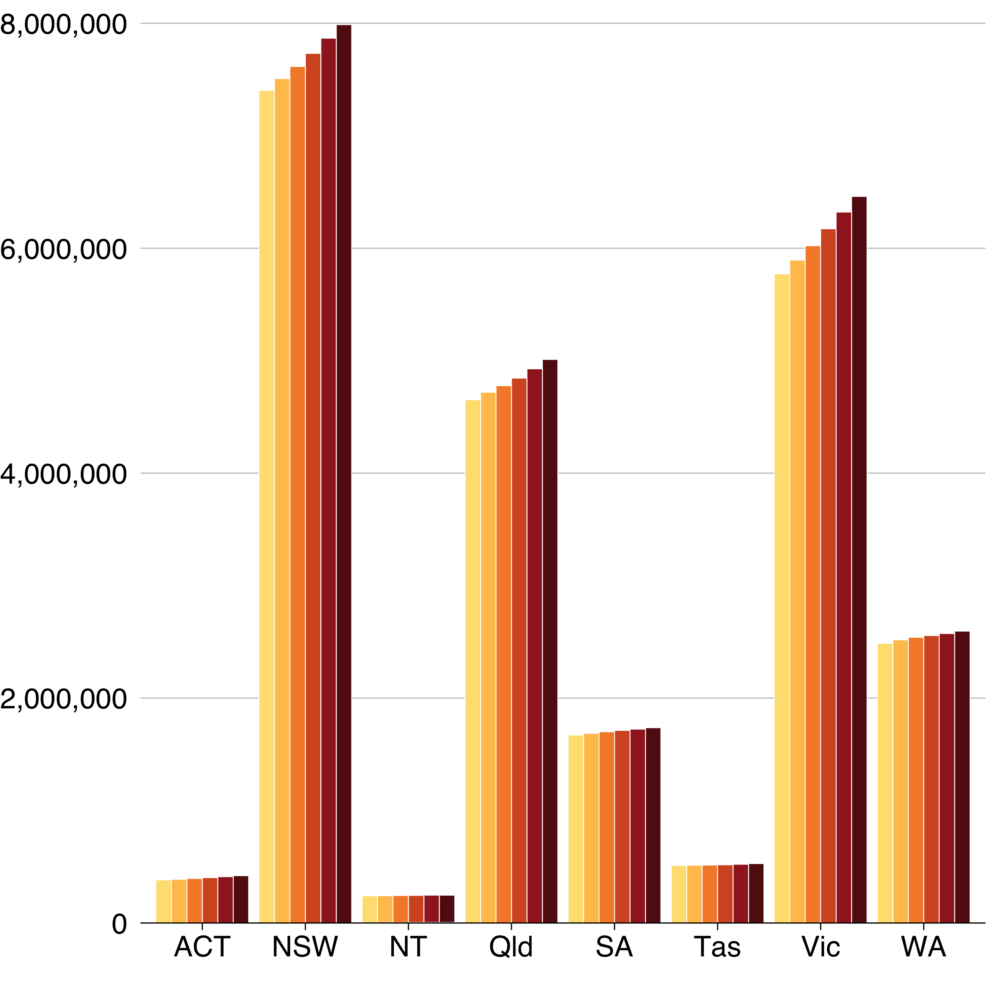
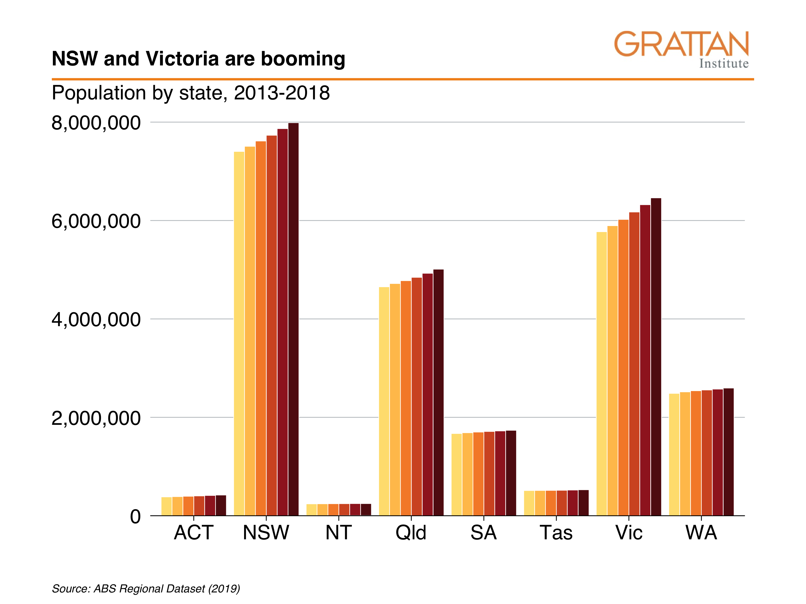
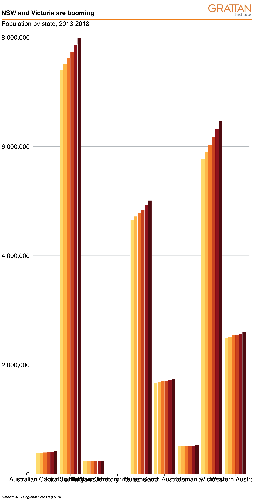

# Data Visualisation

This chapter explores 


## Introduction to data visualisation

Data visualisation is used in two broad ways: 

1. to examine and explore your data; and 
1. to present a finding to your audience. 

When you start using a dataset, you should _look at it_.[^1] Plot histograms of variables-of-interest to spot outliers. Explore correlations with scatter plots and lines-of-best-fit. Check how many observations are in particular groups with bar charts. Identify variables that have missing or coded-missing values. Use faceting to explore differences in the above between groups, and do it interactively with non-static plots. 

  [^1]: From Kieran Healy's _Data Vizualization: A Practical Introduction)_ ([available free ](https://socviz.co/)): 'You should look at your data. Graphs and charts let you explore and learn about the structure of the information you collect. Good data visualizations also make it easier to communicate your ideas and findings to other people.' 


These **exploratory plots** are just for you and your team. They don't need to be perfectly labelled, the right size, in the Grattan palette or be particularly interesting.
They're built and used to explore the data. 
Through this process, you can become confident your data is _what it says it is_. 

When you **present a visualisation to a reader**, you make decisions about what they can and cannot see. You choose to highlight or omit particular things to help them better understand the message you are presenting. 

This requires important technical decisions: what data to use, what 'stat' to present it with --- show every data point, show a distribution function, show the average or the median --- and on what scale --- raw numbers, on a log scale, as a proportion of a total. 

It also requires _aesthetic_ decisions. What colours in the Grattan palette would work best? Where should the labels be placed and how could they be phrased to succinctly convey meaning? Should data points be represented by lines, or bars, or dots, or balloons, or shades of colour?

All of these decisions need to made with two things in mind:

1. Rigour, accuracy, legitimacy: the chart needs to be honest. 
1. The reader: the chart needs to help the reader understand something, and it must convince them to pay attention. 

At the margins, sometimes these two ideas can be in conflict: maybe a 70-word definition in the middle of your chart would improve its technical accuracy, but it could confuse the average reader.

Similarly, a bar chart is often the safest way to display data. But if the reader has stopped paying attention by your sixth consecutive bar chart, your point loses its punch.^['Bar charts are evidence that you are dead inside' -- Amanda Cox, data editor for the New York Times.]

The way we design charts -- much like our writing -- should always be honest, clear and engaging to the reader. 

This chapter shows how you can do this with R. It starts with the 'grammar of graphics' concepts of a package called `ggplot`, explains how to make those charts 'Grattan-y', then provides examples for all common (and some not-so-common) charts you should add to your box of data visualisation tools to impress your message on our readers. 


## Set-up and packages

This section uses the package `ggplot2` to visualise data, and `dplyr` functions to manipulate data. Both of these packages are loaded with `tidyverse`. The `scales` package helps with labelling your axes.

The `grattantheme` package is used to make charts look Grattan-y. The `absmapsdata` package is used to help make maps.

```{r load_packages, message = FALSE}
library(tidyverse)
library(grattantheme)
library(ggrepel)
library(absmapsdata)
library(sf)
library(scales)

```

For most charts in this chapter, we'll use the `population_table` data summarised here. It contains the population in each state between 2013 and 2018:

```{r get_data, message = FALSE}
population_table <- read_csv("data/population_sa4.csv") %>% 
        filter(data_item == "Persons - Total (no.)") %>% 
        mutate(pop = as.numeric(value),
               year = as.factor(year)) %>% 
        group_by(year, sa4_name, state) %>% 
        summarise(pop = sum(pop)) %>% 
        group_by(sa4_name) %>% 
        mutate(pop_growth = 100 * (pop / lag(pop) - 1),
               state_long = state,
               state = strayr::strayr(state_long),
               vicnsw = if_else(state %in% c("Vic", "NSW"),
                                "Vic and NSW",
                                "Other")) %>% 
        filter(sa4_name != "Other Territories") # exclude this outlier

population_table$data_item %>% unique()
population_table$sa4_name

# Show the first six rows of the new dataset
head(population_table)
```


## Concepts

The `ggplot2` package is based on the **g**rammar of **g**raphics. ...

The main ingredients to a `ggplot` chart are:

- **Data**: what data should be plotted. 
  - e.g. `data`
- **Aesthetics**: what variables should be linked to what chart elements. 
  - e.g. `aes(x = population, y = age)` to connect the `population` variable to the `x` axis, and the `age` variable to the `y` axis. 
- **Geoms**: how the data should be plotted. 
  - e.g. `geom_point()` will produce a scatter plot, `geom_col` will produce a column chart, `geom_line()` will produce a line chart. 

Each plot you make will be made up of these three elements. The [full list of standard geoms](https://ggplot2.tidyverse.org/reference/) is listed in the `tidyverse` documentation. 

`ggplot` also has a 'cheat sheet' that contains many of the often-used elements of a plot, which you can download [here](https://github.com/rstudio/cheatsheets/raw/master/data-visualization-2.1.pdf).

```{r ggplot_cheat_sheet, echo = FALSE, fig.align = 'center'}
knitr::include_graphics("atlas/ggplot_cheat_sheet.png")
```


```{r example, eval = FALSE, include = FALSE}
ggplot(data = <DATA>) + 
  <GEOM_FUNCTION>(
     mapping = aes(<MAPPINGS>),
     stat = <STAT>, 
     position = <POSITION>
  ) +
  <COORDINATE_FUNCTION> +
  <FACET_FUNCTION>
```

For example, you can plot a column chart by passing the `population_table` dataset into `ggplot()` ("make a chart with this data"). This completes the first step -- data -- and produces an empty plot:

```{r empty_plot}
population_table %>% 
        ggplot()
```


Next, set the `aes` (aesthetics) to `x = state` ("make the x-axis represent state"), `y = pop` ("the y-axis should represent population"), and `fill = year` ("the fill colour represents year"). Now `ggplot` knows where things should _go_. 

If we just plot that, you'll see that `ggplot` knows a little bit more about what we're trying to do. It has the states on the x-axis and range of populations on the y-axis:

```{r empty_aes}
population_table %>% 
        ggplot(aes(x = pop,
                   y = pop_growth,
                   colour = vicnsw))
```


Now that `ggplot` knows where things should go, it needs to how to _plot_ them on the chart. For this we use `geoms`. Tell `ggplot` to take the things it knows and plot them as a column chart by using `geom_col`:

```{r complete_plot}
population_table %>% 
        ggplot(aes(x = pop,
                   y = pop_growth,
                   colour = vicnsw)) + 
        geom_point()
```

Great! Although stacking populations is a bit silly. You can adjust the way a `geom` works with _arguments_. In this case, tell `geom_col` to place the different categories next to each other rather than on-top of each other, using `position = "dodge"`:

```{r with_dodge}
population_table %>% 
        ggplot(aes(x = pop,
                   y = pop_growth,
                   colour = vicnsw)) + 
        geom_point(alpha = .6)
```


That makes more sense. The following sections in this chapter will cover a broad range of charts and designs, but they will all use the same building-blocks of `data`, `aes`, and `geom`. 

The rest of the chapter will explore:

  - Exploratory data visualisation
  - Grattanising your charts and choosing colours
  - Saving charts according to Grattan templates
  - Making bar, line, scatter and distribution plots
  - Making maps and interactive charts
  - Adding chart labels

## Exploratory data visualisation

Plotting your data early in the analysis stage can help you quickly identify outliers, oddities, things that don't look quite right. 

## Making Grattan-y charts

The `grattantheme` package contains functions that help _Grattanise_ your charts. It is hosted here: https://github.com/mattcowgill/grattantheme
 
You can install it with `remotes::install_github` from the package:

```{r install_grattantheme, eval = FALSE}
install.packages("remotes")
remotes::install_github("mattcowgill/grattantheme")
```
 
The key functions of `grattantheme` are:

  - `theme_grattan`: set size, font and colour defaults that adhere to the Grattan style guide.
  - `grattan_y_continuous`: sets the right defaults for a continuous y-axis.
  - `grattan_colour_continuous`: pulls colours from the Grattan colour palette for `colour` aesthetics.
  - `grattan_fill_continuous`: pulls colours from the Grattan colour palette for `fill` aesthetics.
  - `grattan_save`: a save function that exports charts in correct report or presentation dimensions.

This section will run through some examples of _Grattanising_ charts. The `ggplot` functions are explored in more detail in the next section.


### Making Grattan charts

Start with a column chart, similar to the one made above:

```{r base_chart}
base_chart <- population_table %>% 
        ggplot(aes(x = pop,
                   y = pop_growth,
                   colour = vicnsw)) + 
        geom_point(alpha = .6) +
        labs(x = "",
             title = "Large areas have grown the most",
             subtitle = "Population and growth by state, 2013-2018",
             caption = "Source: ABS Regional Dataset (2019)")

base_chart
```


Let's make it Grattany. First, add `theme_grattan` to your plot:

```{r add_theme_grattan}
base_chart +
        theme_grattan()
```

Then `grattan_y_continuous` to align the x-axis with zero. This function takes the same arguments as `scale_y_continuous`, so you can add `labels = comma()` to reformat the y-axis labels:

```{r add_grattan_y_continuous}
base_chart +
        theme_grattan() +
        grattan_y_continuous() +
        grattan_x_continuous(labels = comma)
```

To define `fill` colours, use `grattan_colour_manual` with the number of colours you need (six, in this case):

```{r add_fill}
pop_chart <- base_chart +
        theme_grattan() +
        grattan_y_continuous(labels = comma) +
        grattan_colour_manual(2) + 
        grattan_x_continuous(labels = comma)

pop_chart
```


Nice chart! Now you can save it and share it with the world.

### Saving Grattan charts

The `grattan_save` function saves your charts according to Grattan templates. It takes these arguments:

  - `filename`: the path, name and file-type of your saved chart. eg: `"atlas/population_chart.pdf"`.
  - `object`: the R object that you want to save. eg: `pop_chart`. If left blank, it grabs the last chart that was displayed.
  - `type`: the Grattan template to be used. This is one of:
    - `"normal"` The default. Use for normal Grattan report charts, or to paste into a 4:3 PowerPoint slide. Width: 22.2cm, height: 14.5cm.
    - `"normal_169"` Only useful for pasting into a 16:9 format Grattan PowerPoint slide. Width: 30cm, height: 14.5cm.
    - `"tiny"` Fills the width of a column in a Grattan report, but is shorter than usual. Width: 22.2cm, height: 11.1cm.
    - `"wholecolumn"` Takes up a whole column in a Grattan report. Width: 22.2cm, height: 22.2cm.
    - `"fullpage"` Fills a whole page of a Grattan report. Width: 44.3cm, height: 22.2cm.
    - `"fullslide"` Creates an image that looks like a 4:3 Grattan PowerPoint slide, complete with logo. Width: 25.4cm, height: 19.0cm.
    - `"fullslide_169"` Creates` an image that looks like a 16:9 Grattan PowerPoint slide, complete with logo. Use this to drop into standard presentations. Width: 33.9cm, height: 19.0cm
    - `"blog"` Creates a 4:3 image that looks like a Grattan PowerPoint slide, but with less border whitespace than 'fullslide'."
    - `"fullslide_44" Creates` an image that looks like a 4:4 Grattan PowerPoint slide. This may be useful for taller charts for the Grattan blog; not useful for any other purpose. Width: 25.4cm, height: 25.4cm.
    - Set `type = "all"` to save your chart in all available sizes.
  - `height`: override the height set by `type`. This can be useful for really long charts in blogposts.
  - `save_data`: exports a `csv` file containing the data used in the chart.
  - `force_labs`: override the removal of labels for a particular `type`. eg `force_labs = TRUE` will keep the y-axis label.
  
To save the `pop_chart` plot created above as a whole-column chart for a **report**:
  
```{r save_show1, eval = FALSE}
grattan_save("atlas/population_chart_report.pdf", pop_chart, type = "wholecolumn")
```

<!--- background: include=FALSE, echo=FALSE, results=FALSE ---->
```{r save_hide1, message = FALSE, echo = FALSE}
grattan_save("atlas/population_chart_report.png", pop_chart, type = "wholecolumn")

```


To save it as a **presentation** slide instead, use `type = "fullslide"`:

```{r save_show2, eval = FALSE}
grattan_save("atlas/population_chart_presentation.pdf", pop_chart, type = "fullslide")
```

<!--- background: include=FALSE, echo=FALSE, results=FALSE ---->
```{r save_hide2, message = FALSE, echo = FALSE, include = FALSE}
grattan_save("atlas/population_chart_presentation.png", pop_chart, type = "fullslide")
```

```{r knit_hide1, message = FALSE, echo = FALSE}

```


Or, if you want to emphasise the point in a _really tall_ chart for a **blogpost**, you can use `type = "blog"` and adjust the `height` to be 50cm. Also note that because this is for the blog, you should save it as a `png` file:

```{r save_show3, eval = FALSE}
grattan_save("atlas/population_chart_blog.png", pop_chart, 
             type = "blog", height = 30)
```

<!--- background: include=FALSE, echo=FALSE, results=FALSE ---->
```{r save_hide3, message = FALSE, echo = FALSE, include = FALSE}
grattan_save("atlas/population_chart_blog.png", pop_chart, 
             type = "blog", height = 30)
```

```{r knit_hide2, message = FALSE, echo = FALSE}

```

And that's it! The following sections will go into more detail about different chart types in R, but you'll mostly use the same basic `grattantheme` formatting you've used here.


## Adding labels

Labels can be a bit finicky -- especially compared to labelling charts visually in PowerPoint. ...

Labels can be done in two broad ways:

1. As a single plot of text on the chart: the command `annotate` takes some text and plots it at the coordinates you specifiy. 
2. As data, using aesthetics: `geom_label` and `geom_text` (and some useful extensions) fit into this group. They take aesthetics from a dataframe and plot text on the chart according to those rules.

**`annotate`** works well if you want to add a note to your chart. You specify the geom type, `"text"`, and the `x` and `y` coordinates: `"Vic"` and `7.2e6` (`7.2*10^6`, 7.2 million). Then set the `size`, `colour`, and horizontal alignment with `hjust` (0 is left-aligned, 0.5 is centered, 1 is right-aligned). Add your text with `label`, and add some line-breaks with `\n`. 

```{r add_annotate, fig.height=6}
base_chart +
        theme_grattan() +
        grattan_y_continuous(labels = comma) +
        grattan_colour_manual(2) + 
        grattan_x_continuous(labels = comma) + 
        annotate("text", x = 600e3, y = -.5, 
                 size = 12/.pt, colour = grattan_red,
                 label = "Victoria or NSW") + 
        annotate("text", x = 600e3, y = -1, 
               size = 12/.pt, colour = grattan_orange,
               label = "Other states and territories")

```

If you want to add more than one label -- for example, if you want to label each bar with its year in our example -- adding multiple `annotates` is tedious. This is where `geom_text` (and its friend `geom_text`, which is the same but with different default settings) comes in.

`geom_text` works like any other `geom`: it takes data and uses aesthetics to plot text on your chart. But, as you'll see shortly, you'll often want to filter the data you pass into `geom_text`. 

First, we'll update our `base_chart` to include our work done so far. We'll also add `grattan_colour_manual(6)` to this new base chart because we'll be using `colour` later:

```{r}
label_chart <- base_chart +
        theme_grattan() +
        grattan_y_continuous(labels = comma) +
        grattan_colour_manual(2) + 
        grattan_x_continuous(labels = comma)
```

Now take `label_chart` and add `geom_text`, specifiying the aesthetics `label` (the text you want to show) and `colour` (the colour of the text). 


```{r}
label_chart +
  geom_text(aes(label = vicnsw))

```

Great! That looks _terrible_. `geom_text` is labelling each individual point, and the labels are overlapping.

We can address the first issue by creating a new dataset:

```{r}
label_data <- population_table %>% 
  group_by(vicnsw) %>% 
  filter(pop == max(pop))

a <- label_chart +
  geom_text(aes(label = sa4_name))

plotly::ggplotly(a)
```


Looking better: the year labels are aligned with the right bars. The next issue is that we don't want a label on _each and every_ bar. Labels on just set of bars -- one state -- will do.

You can do this by supplying a different dataset to `geom_text`. Create a `label_df` dataset that only keeps observations from Queensland, then give that to `geom_text`:

```{r}
label_df <- population_table %>% 
  filter(state == "Qld")

label_chart +
  geom_text(data = label_df,
            aes(label = year,
                 colour = year),
             position = position_dodge(width = 1))

```

Now we're cooking. We have the right labels above the right areas. Now we need to tweak them to fit out plot.

First, we'll try to make the labels smaller so they all fit:


```{r}
label_df <- population_table %>% 
  filter(state == "Qld") %>% 
  mutate(pop = pop + .3e6)

label_chart +
  geom_text(data = label_df,
            aes(label = year,
                 colour = year),
            position = position_dodge(width = 1), check_overlap = T,
            angle = 90, size = 6/.pt, vjust = .5)

```


```{r}
label_chart +
  ggrepel::geom_text_repel(aes(label = year,
                 colour = year),
             position = position_dodge(width = 1, preserve = "total"),
             size = 14/.pt, direction = "y", nudge_y = 1e6)

```


```{r add_label, fig.height=6}
labels <- population_table %>% 
  filter(state == "Qld")

base_chart +
        theme_grattan() +
        grattan_y_continuous(labels = comma) +
        grattan_fill_manual(6) +
        geom_text(data = labels, 
                   aes(label = year,
                       colour = ),
                   size = 16/.pt, 
                  position = position_dodge(width = 1),
                  angle = 90, hjust = -.25, vjust = 0.5) + 
        grattan_colour_manual(6)
  

pop_chart
```


## Chart cookbook

This section takes you through a few often-used chart types. 

### Bar charts

Bar charts are made with `geom_bar` or `geom_col`. Creating a bar chart will look something like this:


```{r bar1, eval = FALSE}
ggplot(data = <data>) + 
  geom_bar(aes(x = <xvar>, y = <yvar>),
     stat = <STAT>, 
     position = <POSITION>
  )
```


It has two key arguments: `stat` and `position`. 

First, `stat` defines what kind of _operation_ the function will do on the dataset before plotting. Some options are:

- `"count"`, the default: count the number of observations in a particular group, and plot that number. This is useful when you're using microdata. When this is the case, there is no need for a `y` aesthetic.
- `"sum"`: sum the values of the `y` aesthetic.
- `"identity"`: directly report the values of the `y` aesthetic. This is how PowerPoint and Excel charts work.

You can use `geom_col` instead, as a shortcut for `geom_bar(stat = "identity)`. 

Second, `position`, dictates how multiple bars occupying the same x-axis position will positioned. The options are:

- `"stack"`, the default: bars in the same group are stacked atop one another.
- `"dodge"`: bars in the same group are positioned next to one another.
- `"fill"`: bars in the same group are stacked and all fill to 100 per cent.


```{r bar2}
population_table %>% 
        ggplot(aes(x = state,
                   y = pop,
                   fill = year)) +
        geom_bar(stat = "identity",
                 position = "dodge") +
        theme_grattan() +
        grattan_y_continuous(labels = comma) +
        grattan_fill_manual(6) + 
        labs(x = "",
             y = "")
```


You can also **order** the groups in your chart by a variable. If you want to order states by population, use `reorder` inside `aes`:

```{r bar3}
population_table %>% 
        ggplot(aes(x = reorder(state, -pop), # reorder state by negative population
                   y = pop,
                   fill = year)) +
        geom_bar(stat = "identity",
                 position = "dodge") +
        theme_grattan() +
        grattan_y_continuous(labels = comma) +
        grattan_fill_manual(6) + 
        labs(x = "",
             y = "")
```

To flip the chart -- a useful move when you have long labels -- add `coord_flipped` (ie 'flip coordinates') and tell `theme_grattan` that the plot is flipped using `flipped = TRUE`. 

```{r bar4}
population_table %>% 
        ggplot(aes(x = reorder(state, -pop), 
                   y = pop,
                   fill = year)) +
        geom_bar(stat = "identity",
                 position = "dodge") +
        coord_flip() +  # flip the coordinates
        theme_grattan(flipped = TRUE) +  # tell theme_grattan
        grattan_y_continuous(labels = comma) +
        grattan_fill_manual(6) + 
        labs(x = "",
             y = "")
```


Our long numeric labels means the chart clips them off a bit at the end. We can deal with this in two ways:

1. Adjust the limits of the axis to accommodate the long labels, meaning we will have to define our own axis-label breaks using the `seq` function^[`seq(x1, x2, y)` will return a vector of numbers between `x1` and `x2`, spaced by `y`. For example: `seq(0, 10, 2)` will produce `0  2  4  6  8  10`]:

```{r bar5}
population_table %>% 
        ggplot(aes(x = reorder(state, -pop), 
                   y = pop,
                   fill = year)) +
        geom_bar(stat = "identity",
                 position = "dodge") +
        coord_flip() +  
        theme_grattan(flipped = TRUE) + 
        grattan_y_continuous(labels = comma,
                             limits = c(0, 9e6),
                             breaks = seq(0, 8e6, 2e6)) +
        grattan_fill_manual(6) + 
        labs(x = "",
             y = "")

```


2. Add empty space at the top of the chart to accommodate the long labels:

```{r bar6}
population_table %>% 
        ggplot(aes(x = reorder(state, -pop), 
                   y = pop,
                   fill = year)) +
        geom_bar(stat = "identity",
                 position = "dodge") +
        coord_flip() +  
        theme_grattan(flipped = TRUE) + 
        grattan_y_continuous(labels = comma, 
                             expand_top = .1) +
        grattan_fill_manual(6) + 
        labs(x = "",
             y = "")

```

### Line charts

A line chart has one key aesthetic: `group`. This tells `ggplot` how to connect individual lines.

```{r line1, message = FALSE}
population_table %>% 
        ggplot(aes(x = year,
                   y = pop,
                   colour = state,
                   group = state)) +
        geom_line() +
        theme_grattan() +
        grattan_y_continuous(labels = comma) +
        grattan_colour_manual(9) +
        labs(x = "")
```

You can also add dots for each year by layering `geom_point` on top of `geom_line`:

```{r line2, message = FALSE}
population_table %>% 
        ggplot(aes(x = year,
                   y = pop,
                   colour = state,
                   group = state)) +
        geom_line() +
        geom_point(size = 2) + 
        theme_grattan() +
        grattan_y_continuous(labels = comma) +
        grattan_colour_manual(9) + 
        labs(x = "",
             y = "")
```

If you wanted to show each state individually, you could **facet** your chart so that a separate plot was produced for each state:

```{r line3, message = FALSE}
population_table %>% 
        filter(state != "ACT",
               state != "NT") %>% 
        ggplot(aes(x = year,
                   y = pop,
                   group = state)) +
        geom_line() +
        geom_point(size = 2) + 
        theme_grattan() +
        grattan_y_continuous() +
        facet_wrap(state ~ .) + 
        labs(x = "")
```

To tidy this up, we can: 

  1. shorten the years to be "13", "14", etc instead of "2013", "2014", etc (via the `x` aesthetic)
  1. shorten the y-axis labels to "millions" (via the `y` aesthetic)
  1. add a black horizontal line at the bottom of each facet
  1. give the facets a bit of room by adjusting `panel.spacing`
  1. define our own x-axis label breaks to just show `13`, `15` and `17`


```{r line4, message = FALSE}
population_table %>% 
        filter(state != "ACT",
               state != "NT") %>% 
        ggplot(aes(x = substr(year, 3, 4), # 1: just take the last two characters
                   y = pop / 1e6, # 2: divide population by one million
                   group = state)) +
        geom_line() +
        geom_point(size = 2) + 
        geom_hline(yintercept = 0) + # 3: add horizontal line at the bottom
        theme_grattan() +
        theme(panel.spacing = unit(10, "mm")) + # 4: add panel spacing
        grattan_y_continuous(labels = comma) +
        scale_x_discrete(breaks = c("13", "15", "17")) + # 5: define our own label breaks
        facet_wrap(state ~ .) + 
        labs(x = "")
```


### Scatter plots

Scatter plots require `x` and `y` aesthetics. These can then be coloured and faceted.

First, create a dataset that we'll use for scatter plots. Take the `population_table` dataset and transform it to have one variable for population in 2013, and another for population in 2018:

```{r scatter_data, message = FALSE}
population_diff <- read_csv("data/population_sa4.csv") %>% 
        mutate(state_long = state,
               state = strayr::strayr(state_long),
               pop = as.numeric(value),
               year = as.factor(glue::glue("y{year}"))) %>% 
        filter(year %in% c("y2013", "y2018"),
               data_item == "Persons - Total (no.)",
               sa4_name != "Other Territories") %>% 
        group_by(year, state, sa4_name) %>% 
        summarise(pop = sum(pop)) %>% 
        spread(year, pop) %>% 
        mutate(pop_change = 100 * (y2018 / y2013 - 1))

```

 
Then plot it  
 
```{r scatter, message = FALSE}
population_diff %>% 
        ggplot(aes(x = y2013,
                   y = pop_change)) +
        geom_point(size = 4) + 
        theme_grattan() +
        theme(axis.title.y = element_text(angle = 90)) +
        grattan_y_continuous() + 
        labs(y = "Population increase to 2018, per cent",
             x = "Population in 2013")
```


```{r scatter_rescale, message = FALSE}
population_diff %>% 
        ggplot(aes(x = y2013/1000,
                   y = pop_change)) +
        geom_point(size = 4) + 
        theme_grattan() +
        theme(axis.title.y = element_text(angle = 90)) +
        grattan_y_continuous() + 
        labs(y = "Population increase to 2018, per cent",
             x = "Population in 2013, thousands")
```


It looks like the areas with the largest population grew the most between 2013 and 2018. To explore the relationship further, you can add a line-of-best-fit with `geom_smooth`:

```{r scatter_smooth, message = FALSE}
population_diff %>% 
        ggplot(aes(x = y2013/1000,  # display the x-axis as thousands
                   y = pop_change)) +
        geom_point(size = 4) + 
        geom_smooth() + 
        geom_hline(yintercept = 0) +
        theme_grattan() +
        theme(axis.title.y = element_text(angle = 90)) +
        grattan_y_continuous() + 
        labs(y = "Population increase to 2018, per cent",
             x = "Population in 2013, thousands")
```


You could colour-code positive and negative changes from within the `geom_point` aesthetic. Making a change there won't pass through to the `geom_smooth` aesthetic, so your line-of-best-fit will apply to all data points.

```{r scatter_colour, message = FALSE}
population_diff %>% 
        ggplot(aes(x = y2013/1000,  # display the x-axis as thousands
                   y = pop_change)) +
        geom_point(aes(colour = pop_change < 0),
                   size = 4) + 
        geom_smooth() + 
        geom_hline(yintercept = 0) +
        theme_grattan() +
        theme(axis.title.y = element_text(angle = 90)) +
        grattan_y_continuous() + 
        grattan_colour_manual(2) +
        labs(y = "Population increase to 2018, per cent",
             x = "Population in 2013, thousands")
```


Like the charts above, you could facet this by state to see if there were any interesting patterns. We'll filter out ACT and NT because they only have one and two data points (SA4s) in them, respectively.

```{r scatter_facet, message = FALSE, warning = FALSE}
population_diff %>% 
        filter(state != "ACT",
               state != "NT") %>% 
        ggplot(aes(x = y2013/1000,  # display the x-axis as thousands
                   y = pop_change)) +
        geom_point(aes(colour = pop_change < 0),
                   size = 2) +
        geom_smooth() + 
        geom_hline(yintercept = 0) +
        theme_grattan() +
        theme(axis.title.y = element_text(angle = 90)) +
        grattan_y_continuous() + 
        grattan_colour_manual(2) +
        labs(y = "Population increase to 2018, per cent",
             x = "Population in 2013, thousands") +
        facet_wrap(state ~ .)
```


### Distributions

`geom_histogram`
`geom_density`

`ggridges::`


### Maps

#### `sf` objects
[what is]

#### Using `absmapsdata`

The `absmapsdata` contains compressed, and tidied `sf` objects containing geometric information about ABS data structures. The included objects are:

  - Statistical Area 1 2011 and 2016: `sa12011` or `sa12016`
  - Statistical Area 2 2011 and 2016: `sa22011` or `sa22016`
  - Statistical Area 3 2011 and 2016: `sa32011` or `sa32016`
  - Statistical Area 4 2011 and 2016: `sa42011` or `sa42016`
  - Greater Capital Cities 2011 and 2016: `gcc2011` or `gcc2016`
  - Remoteness Areas 2011 and 2016: `ra2011` or `ra2016`
  - State 2011 and 2016: `state2011` or `state2016`
  - Commonwealth Electoral Divisions 2018: `ced2018`
  - State Electoral Divisions 2018:`sed2018`
  - Local Government Areas 2016 and 2018: `lga2016` or `lga2018`
  - Postcodes 2016: `postcodes2016`

You can install the package from Github:

```{r install_absmapsdata, eval = FALSE}
remotes::install_github("wfmackey/absmapsdata")
library(absmapsdata)
```

You will also need the `sf` package installed to handle the `sf` objects:

```{r install_sf, eval = FALSE}
install.packages("sf")
library(sf)
```


#### Making choropleth maps

Choropleth maps break an area into 'bits', and colours each 'bit' according to a variable.

SA4 is the largest non-state statistical area in the ABS ASGS standard. 

You can join the `sf` objects from `absmapsdata` to your dataset using `left_join`. The variable names might be different -- eg `sa4_name` compared to `sa4_name_2016` -- so use the `by` function to match them.

```{r make_map_data, message = FALSE}
map_data <- population_diff %>% 
        left_join(sa42016, by = c("sa4_name" = "sa4_name_2016"))

head(map_data %>% 
       select(sa4_name, geometry))
```

You then plot a map like you would any other `ggplot`: provide your data, then choose your `aes` and your `geom`. For maps with `sf` objects, the **key aesthetic** is `geometry = geometry`, and the **key geom** is `geom_sf`.

The argument `lwd` controls the line width of area borders.

Note that RStudio takes a long time to render a map in the 


```{r map1}
map <- map_data %>% 
        ggplot(aes(geometry = geometry,
                   fill = pop_change)) +
        geom_sf(lwd = 0) +
        theme_void() +
        grattan_fill_manual(discrete = FALSE, 
                            palette = "diverging",
                            limits = c(-20, 20),
                            breaks = seq(-20, 20, 10)) +
  labs(fill = "Population \nchange")

map
```

Showing all of Australia on a single map is difficult: there are enormous areas that are home to few people which dominate the space. Showing individual states or capital city areas can sometimes be useful. 

To do this, filter the `map_data` object: 

```{r map_filter}
map <- map_data %>% 
        filter(state == "Vic") %>% 
        ggplot(aes(geometry = geometry,
                   fill = pop_change)) +
        geom_sf(lwd = 0) +
        theme_void() +
        grattan_fill_manual(discrete = FALSE, 
                            palette = "diverging",
                            limits = c(-20, 20),
                            breaks = seq(-20, 20, 10)) +
  labs(fill = "Population \nchange")

map
```


##### Adding labels to maps

You can add labels to choropleth maps with the standard `geom_text` or `geom_label`. Because it is likely that some labels will overlap, `ggrepel::geom_text_repel` or `ggrepel::geom_label_repel` is usually the better option.

To use `geom_(text|label)_repel`, you need to tell `ggrepel` where in 


```{r map_label, warning = FALSE}
map <- map_data %>% 
        filter(state == "Vic") %>% 
        ggplot(aes(geometry = geometry)) +
        geom_sf(aes(fill = pop_change),
                lwd = .1,
                colour = "black") +
        theme_void() +
        grattan_fill_manual(discrete = FALSE, 
                            palette = "diverging",
                            limits = c(-20, 20),
                            breaks = seq(-20, 20, 10)) +
  geom_label_repel(aes(label = sa4_name),
                  stat = "sf_coordinates", nudge_x = 1000, segment.alpha = .5,
                  size = 4, 
                  direction = "y",
                  label.size = 0, 
                  label.padding = unit(0.1, "lines"),
                  colour = "grey50",
                  segment.color = "grey50") + 
  scale_y_continuous(expand = expand_scale(mult = c(0, .2))) + 
  theme(legend.position = "top") + 
  labs(fill = "Population \nchange")

map
```


## Creating simple interactive graphs with `plotly`

`plotly::ggplotly()`


## bin: generate data used (before prior sections are constructed)

```{r, eval = FALSE}
library(tidyverse)
library(janitor)
library(absmapsdata)

data <- read_csv("data/ABS_REGIONAL_ASGS2016_02082019164509969.csv") %>% 
        clean_names() %>% 
        select(data_code = measure,
               data_item,
               asgs = regiontype,
               sa4_code_2016 = asgs_2016,
               sa4_name_2016 = region,
               year = time,
               value) %>% 
        mutate(sa4_code_2016 = as.character(sa4_code_2016)) %>% 
        left_join(sa42016 %>% select(sa4_code_2016, state_name_2016)) %>% 
        rename(state = state_name_2016,
               sa4_code = sa4_code_2016,
               sa4_name = sa4_name_2016) %>% 
        mutate(state_long = state,
               state = strayr::strayr(state_long))
               
write_csv(data, "data/population_sa4.csv")
```


