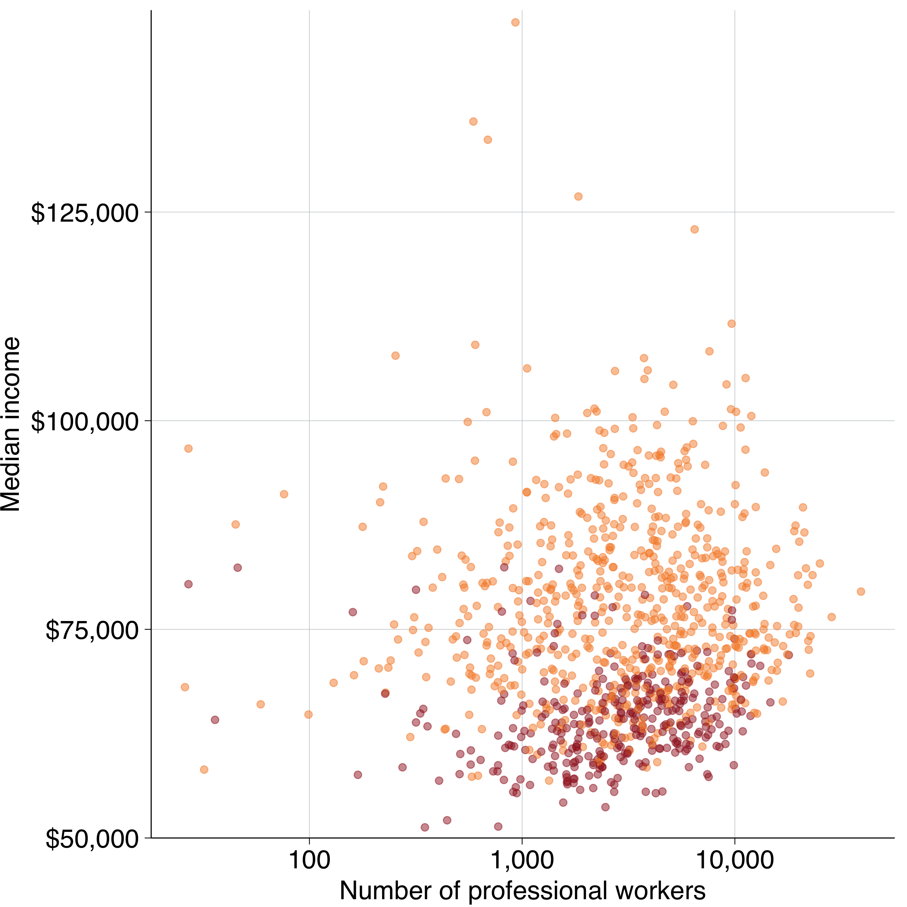
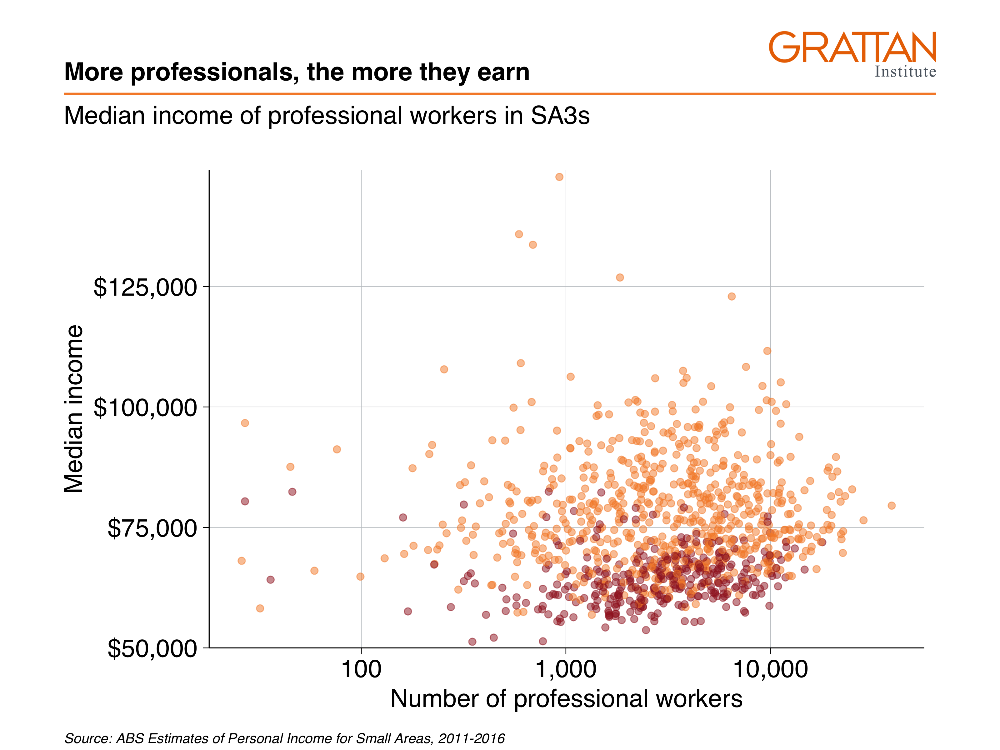

# Data Visualisation

This chapter explores data visualisation broadly, and how to 'do' data visualisation in R specifically. 

The next chapter -- the Visualisation Cookbook -- gives more practical advice for the charts you might want to create. 


## Introduction to data visualisation

You can use data visualisation to **examine and explore** your data, and to **present** a finding to your audience. Both of these elements are important.

When you start using a dataset, you should look at it.[^1] Plot histograms of variables-of-interest to spot outliers. Explore correlations between variables with scatter plots and lines-of-best-fit. Check how many observations are in particular groups with bar charts. Identify variables that have missing or coded-missing values. Use faceting to explore differences in the above between groups, and do it interactively with non-static plots. 

  [^1]: From Kieran Healy's [_Data Vizualization: A Practical Introduction_](https://socviz.co/): 'You should look at your data. Graphs and charts let you explore and learn about the structure of the information you collect. Good data visualizations also make it easier to communicate your ideas and findings to other people.' 


These **exploratory plots** are just for you and your team. They don't need to be perfectly labelled, the right size, in the Grattan palette, or be particularly interesting.
They're built and used only to help you and your team explore the data. 
Through this process, you can become confident your data is _what you think it is_. 

When you choose to **present a visualisation to a reader**, you have to make decisions about what they can and cannot see. You need to highlight or omit particular things to help them better understand the message you are presenting. 

This requires important _technical_ decisions: what data to use, what 'stat' to present it with --- _show every data point, show a distribution function, show the average or the median?_ --- and on what scale --- _raw numbers, on a log scale, as a proportion of a total?_. 

It also requires _aesthetic_ decisions. What colours in the Grattan palette would work best? Where should the labels be placed and how could they be phrased to succinctly convey meaning? Should data points be represented by lines, or bars, or dots, or balloons, or shades of colour?

All of these decisions need to made with two things in mind:

1. Rigour, accuracy, legitimacy: the chart needs to be honest. 
1. The reader: the chart needs to help the reader understand something, and it must convince them to pay attention. 

At the margins, sometimes these two ideas can be in conflict. Maybe a 70-word definition in the middle of your chart would improve its technical accuracy, but it could confuse the average reader and reduce the chart's impact.

Similarly, a bar chart is often the safest way to display data. Like our prose, our charts need to be designed for an interested teenager. But we need to _earn_ their interest. If your reader has seen four similar bar charts in a row and has stopped paying attention by the fifth, your point loses its punch.^['Bar charts are evidence that you are dead inside' -- Amanda Cox, data editor for the New York Times.] 

The way we design charts -- much like our writing -- should always be honest, clear and engaging to the reader. 

This chapter shows how you can do this with R. It starts with the 'grammar of graphics' concepts of a package called `ggplot`, and explains how to make those charts 'Grattan-y'. The next chapter gives you the when-to-use and how-to-make particular charts. 


## Set-up and packages

This section uses the package `ggplot2` to visualise data, and `dplyr` functions to manipulate data. Both of these packages are loaded with `tidyverse`. The `scales` package helps with labelling your axes.

The `grattantheme` package is used to make charts look Grattan-y. The `absmapsdata` package is used to help make maps.

```{r load_packages, message = FALSE}
library(tidyverse)
library(grattantheme)
library(ggrepel)
library(scales)
```

For most charts in this chapter, we'll use the `sa3_income` data summarised below.^[From [ABS Employee income by occupation and sex, 2010-11 to 2015-16](https://www.abs.gov.au/AUSSTATS/abs@.nsf/DetailsPage/6524.0.55.0022011-2016?OpenDocument)] It is a long dataset containing the median income and number of workers by SA3, occupation and sex between 2010 and 2015. We will also create a `professionals` subset that only includes people in professional occupations in 2015:

```{r get_data, message = FALSE}
sa3_income <- read_csv("data/sa3_income.csv")

professionals <- sa3_income %>% 
  select(-sa4_name, -gcc_name) %>% 
  filter(year == 2015,
         occupation == "Professionals",
         !is.na(median_income),
         !sex == "Persons") 

# Show the first six rows of the new dataset
head(professionals)
```


## Concepts

The `ggplot2` package is based on the **g**rammar of **g**raphics. ...

The main ingredients to a `ggplot` chart are:

- **Data**: what data should be plotted. 
  - e.g. `data`
- **Aesthetics**: what variables should be linked to what chart elements. 
  - e.g. `aes(x = population, y = age)` to connect the `population` variable to the `x` axis, and the `age` variable to the `y` axis. 
- **Geoms**: how the data should be plotted. 
  - e.g. `geom_point()` will produce a scatter plot, `geom_col` will produce a column chart, `geom_line()` will produce a line chart. 

Each plot you make will be made up of these three elements. The [full list of standard geoms](https://ggplot2.tidyverse.org/reference/) is listed in the `tidyverse` documentation. 

`ggplot` also has a 'cheat sheet' that contains many of the often-used elements of a plot, which you can download [here](https://github.com/rstudio/cheatsheets/raw/master/data-visualization-2.1.pdf).

```{r ggplot_cheat_sheet, echo = FALSE, fig.align = 'center'}
knitr::include_graphics("atlas/ggplot_cheat_sheet.png")
```


```{r example, eval = FALSE, include = FALSE}
ggplot(data = <DATA>) + 
  <GEOM_FUNCTION>(
     mapping = aes(<MAPPINGS>),
     stat = <STAT>, 
     position = <POSITION>
  ) +
  <COORDINATE_FUNCTION> +
  <FACET_FUNCTION>
```

For example, you can plot a column chart by passing the `sa3_income` dataset into `ggplot()` ("make a chart with this data"). This completes the first step -- data -- and produces an empty plot:

```{r empty_plot}
professionals %>% 
        ggplot()
```


Next, set the `aes` (aesthetics) to `x = state` ("make the x-axis represent state"), `y = pop` ("the y-axis should represent population"), and `fill = year` ("the fill colour represents year"). Now `ggplot` knows where things should _go_. 

If we just plot that, you'll see that `ggplot` knows a little bit more about what we're trying to do. It has the states on the x-axis and range of populations on the y-axis:

```{r empty_aes}
professionals %>% 
        ggplot(aes(x = workers,
                   y = median_income,
                   colour = sex))
```


Now that `ggplot` knows where things should go, it needs to how to _plot_ them on the chart. For this we use `geoms`. Tell `ggplot` to take the things it knows and plot them as a column chart by using `geom_col`:

```{r complete_plot}
professionals %>%
        ggplot(aes(x = workers,
                   y = median_income,
                   colour = sex)) + 
        geom_point()
```

Great! There are a couple of quick things we can do to make the chart a bit clearer. There are points for each group in each year, which we probably don't need. So filter the data before you pass it to `ggplot` to just include 2015: `filter(year == 2015)`. There will still be lots of overlapping points, so set the opacity to below one with `alpha = 0.5`. The `workers` x-axis can be changed to a log scale with `scale_x_log10`.

```{r with_changes}
professionals %>% 
        ggplot(aes(x = workers,
                   y = median_income,
                   colour = sex)) + 
        geom_point(alpha = .5) + 
        scale_x_log10()
```


That looks a bit better. The following sections in this chapter will cover a broad range of charts and designs, but they will all use the same building-blocks of `data`, `aes`, and `geom`. 

The rest of the chapter will explore:

  - Exploratory data visualisation
  - Grattanising your charts and choosing colours
  - Saving charts according to Grattan templates
  - Making bar, line, scatter and distribution plots
  - Making maps and interactive charts
  - Adding chart labels

## Exploratory data visualisation

Plotting your data early in the analysis stage can help you quickly identify outliers, oddities, things that don't look quite right. 


## Making Grattan-y charts

The `grattantheme` package contains functions that help _Grattanise_ your charts. It is hosted here: https://github.com/mattcowgill/grattantheme
 
You can install it with `remotes::install_github` from the package:

```{r install_grattantheme, eval = FALSE}
install.packages("remotes")
remotes::install_github("mattcowgill/grattantheme")
```
 
The key functions of `grattantheme` are:

  - `theme_grattan`: set size, font and colour defaults that adhere to the Grattan style guide.
  - `grattan_y_continuous`: sets the right defaults for a continuous y-axis.
  - `grattan_colour_continuous`: pulls colours from the Grattan colour palette for `colour` aesthetics.
  - `grattan_fill_continuous`: pulls colours from the Grattan colour palette for `fill` aesthetics.
  - `grattan_save`: a save function that exports charts in correct report or presentation dimensions.

This section will run through some examples of _Grattanising_ charts. The `ggplot` functions are explored in more detail in the next section.


### Making Grattan charts

Start with a scatterplot, similar to the one made above:

```{r base_chart}
base_chart <- professionals %>% 
        ggplot(aes(x = workers,
                   y = median_income,
                   colour = sex)) + 
        geom_point(alpha = .5) + 
        labs(title = "More professionals, the more they earn",
             subtitle = "Median income of professional workers in SA3s",
             x = "Number of professional workers",
             y = "Median income",
             caption = "Source: ABS Estimates of Personal Income for Small Areas, 2011-2016")

base_chart
```


Let's make it Grattany. First, add `theme_grattan` to your plot:

```{r add_theme_grattan}
base_chart +
        theme_grattan()
```

Then use `grattan_y_continuous` to adjust the y-axis. This takes the same arguments as the standard `scale_y_continuous` function, but has Grattan defaults built in. Use it to set the labels as dollars (with `scales::dollar()`) and to give the y-axis some breathing room (starting at \$50,000 rather than the minimum point).
Also add `scale_x_log10` to make the x-axis a log10 scale, telling it to format the labels as numbers with commas (using `scales::comma()`).^[The `dollar` and `comma` commands are functions, but can be used without `()`. Using `dollar()` or `comma()` works too, and you can provide arguments that adjust their output: eg `dollar(suffix = "million")`]

```{r add_grattan_y_continuous}
base_chart +
        theme_grattan() +
        grattan_y_continuous(labels = dollar, limits = c(50e3, NA)) +
        scale_x_log10(labels = comma) 
```

To define `colour` colours, use `grattan_colour_manual` with the number of colours you need (two, in this case):

```{r add_fill}
prof_chart <- base_chart +
        theme_grattan() +
        grattan_y_continuous(labels = dollar, limits = c(50e3, NA)) +
        scale_x_log10(labels = comma) +
        grattan_colour_manual(2) 

prof_chart
```


Nice chart! Now you can save it and share it with the world.

### Saving Grattan charts

The `grattan_save` function saves your charts according to Grattan templates. It takes these arguments:

  - `filename`: the path, name and file-type of your saved chart. eg: `"atlas/professionals_chart.pdf"`.
  - `object`: the R object that you want to save. eg: `prof_chart`. If left blank, it grabs the last chart that was displayed.
  - `type`: the Grattan template to be used. This is one of:
    - `"normal"` The default. Use for normal Grattan report charts, or to paste into a 4:3 PowerPoint slide. Width: 22.2cm, height: 14.5cm.
    - `"normal_169"` Only useful for pasting into a 16:9 format Grattan PowerPoint slide. Width: 30cm, height: 14.5cm.
    - `"tiny"` Fills the width of a column in a Grattan report, but is shorter than usual. Width: 22.2cm, height: 11.1cm.
    - `"wholecolumn"` Takes up a whole column in a Grattan report. Width: 22.2cm, height: 22.2cm.
    - `"fullpage"` Fills a whole page of a Grattan report. Width: 44.3cm, height: 22.2cm.
    - `"fullslide"` Creates an image that looks like a 4:3 Grattan PowerPoint slide, complete with logo. Width: 25.4cm, height: 19.0cm.
    - `"fullslide_169"` Creates` an image that looks like a 16:9 Grattan PowerPoint slide, complete with logo. Use this to drop into standard presentations. Width: 33.9cm, height: 19.0cm
    - `"blog"` Creates a 4:3 image that looks like a Grattan PowerPoint slide, but with less border whitespace than 'fullslide'."
    - `"fullslide_44" Creates` an image that looks like a 4:4 Grattan PowerPoint slide. This may be useful for taller charts for the Grattan blog; not useful for any other purpose. Width: 25.4cm, height: 25.4cm.
    - Set `type = "all"` to save your chart in all available sizes.
  - `height`: override the height set by `type`. This can be useful for really long charts in blogposts.
  - `save_data`: exports a `csv` file containing the data used in the chart.
  - `force_labs`: override the removal of labels for a particular `type`. eg `force_labs = TRUE` will keep the y-axis label.
  
To save the `prof_chart` plot created above as a whole-column chart for a **report**:
  
```{r save_show1, eval = FALSE}
grattan_save("atlas/professionals_chart_report.pdf", prof_chart, type = "wholecolumn")
```

<!--- background: include=FALSE, echo=FALSE, results=FALSE ---->
```{r save_hide1, message = FALSE, echo = FALSE}
grattan_save("atlas/professionals_chart_report.png", prof_chart, type = "wholecolumn")

```


To save it as a **presentation** slide instead, use `type = "fullslide"`:

```{r save_show2, eval = FALSE}
grattan_save("atlas/professionals_chart_presentation.pdf", prof_chart, type = "fullslide")
```

<!--- background: include=FALSE, echo=FALSE, results=FALSE ---->
```{r save_hide2, message = FALSE, echo = FALSE, include = FALSE}
grattan_save("atlas/professionals_chart_presentation.png", prof_chart, type = "fullslide")
```

```{r knit_hide1, message = FALSE, echo = FALSE}

```


Or, if you want to emphasise the point in a _really tall_ chart for a **blogpost**, you can use `type = "blog"` and adjust the `height` to be 50cm. Also note that because this is for the blog, you should save it as a `png` file:

```{r save_show3, eval = FALSE}
grattan_save("atlas/professionals_chart_blog.png", prof_chart, 
             type = "blog", height = 30)
```

<!--- background: include=FALSE, echo=FALSE, results=FALSE ---->
```{r save_hide3, message = FALSE, echo = FALSE, include = FALSE}
grattan_save("atlas/professionals_chart_blog.png", prof_chart, 
             type = "blog", height = 30)
```

```{r knit_hide2, message = FALSE, echo = FALSE}
knitr::include_graphics("atlas/professionals_chart_blog.png")
```

And that's it! The following sections will go into more detail about different chart types in R, but you'll mostly use the same basic `grattantheme` formatting you've used here.


## Adding labels

Labels can be a bit finicky -- especially compared to labelling charts visually in PowerPoint. ...

Labels can be done in two broad ways:

1. Labelling every single data point on your chart. Grattan charts rarely do this. 
2. Labelling some of the data points on your chart. This is how you label Grattan charts: label on item in a group and let the reader join the dots. 

We'll look at the first approach so you can get a feel for how the labelling geoms -- `geom_label` and `geom_text` (and some useful extensions) -- work. It won't be pretty.


```{r add_annotate, fig.height=6}
prof_chart +
  geom_text(aes(label = sex))
```

Great! That looks _terrible_. `geom_text` is labelling each individual point because it has been told to do so. Just like `geom_point`, it takes the `x` and `y` aesthetics of each observation, then plots the `label` at that location. But we just want to label one of the points for `female` and one for `male`. 

To do this, we can create a new dataset that just contains one observation each. Here, you're filtering the dataset to include _only_ the female/male observations that have the most people:

```{r}
label_data <- professionals %>% 
  group_by(sex) %>% 
  filter(workers == max(workers)) %>% 
  ungroup()

label_data
```

And then tell `geom_text` to look at _that_ dataset:
```{r}
prof_chart +
  geom_text(data = label_data,
            aes(label = sex))
```

Okay, not bad. The labels go off the chart. You could fix this by shortening the labels either inside the `label_data`:

```{r}
label_data_short <- label_data %>% 
  mutate(sex_label = if_else(sex == "Females", 
                             "Women", 
                             "Men"))

prof_chart +
  geom_text(data = label_data_short,
            aes(label = sex_label))
```

_Or_ you could adjust the label values directly inside the aesthetics call. Note that this means you have to provide a vector that is the same length as the number of observations in the data (a length of two, in this case).

```{r}
prof_chart +
  geom_text(data = label_data,
            aes(label = c("Women", "Men")))
```


To have more freedom over _where_ your labels are placed, you can create a dataset yourself. Add the `x` and `y` values for your labels, and the label names.^[We are using the `tribble` function here to make it a little bit clearer what values apply to which sex. The 'normal' way to create a tibble is with the `tibble` function: <br> `tibble(x = c(10, 100), y = c(100, 10))`, etc.]

```{r}
self_label <- tribble(
~sex,      ~sex_label, ~workers,   ~median_income,
"Females",    "Women",    23000,            55000,
"Males",        "Men",    23000,           110000)


self_label

```


```{r}

prof_chart +
  geom_text(data = self_label,
            aes(label = sex_label), 
            hjust = 1)
```
