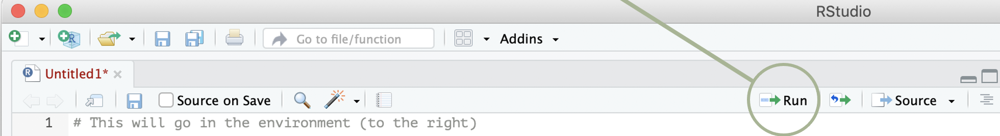

# Getting started {#getting-started}

This chapter gets you up and running with R Studio and writing R code like a real hacker.

::: {.rmdimportant}
**Goals**:
By the end of this chapter you will have R and R Studio installed, and be able to write, execute and understand some simple R code.
:::

## Installing R and RStudio

Although you'll usually work with R by opening RStudio, you need to install both R and RStudio separately. 

Install R by going to [CRAN](https://cran.r-project.org), the Comprehensive R Archive Network. CRAN is a community-run website that houses R itself as well as a broad range of R packages. 

```{r cran, echo = FALSE, out.width='100%'}
knitr::include_graphics("atlas/r_cran.png")
```

You want to download the latest base R release, as a 'binary'. Don't worry, you don't need to know what a binary is.

For macOS, the page will look like this:
```{r cran_mac2, echo = FALSE, out.width='100%'}
knitr::include_graphics("atlas/r_cran_macos.png")
```

For Windows, you'll need to click on the 'base' version, and then click again to start the download.

```{r cran_windows, echo = FALSE, out.width='100%'}
knitr::include_graphics("atlas/r_cran_windows_1.png")
knitr::include_graphics("atlas/r_cran_windows_2.png")
```

Once you've installed R, you'll need to install RStudio. Go to the [RStudio website and install the latest version](https://www.rstudio.com/products/rstudio/download/#download) of RStudio Desktop (open source license).

Once they're both installed, get started by opening RStudio. 

## Setting up RStudio

_Will to finish. Include:_ 

* Save data off (and other good defaults)
* Colour theme (important!)

## Scripts and 'coding'

R is a script-based program. You write a list of instructions and R will follow it. This is wonderfully handy: 

- everything you have told it to do, it will do;
- you have a record of everything you have told it to do. 

But 'coding' can intimidating! However, it’s just a list of instructions. If you have ever used Excel you have used functions to create output. You have written code. You're already a coder! 

We can greatly enhance the things we can do by using R. The rest of this chapter is a short guide to walk you through your first lines of R code. If you get stuck or something doesn't work or you have an urge to throw your computer out the window, please reach out to Will or James, or post on the `#r_at_grattan` [Slack channel](#seeking-help), and someone will help you out.

## A practical introduction to writing R code

### Starting a new script and defining an object

From within RStudio, open a new script by: File -> New File -> R Script.

In that script, let’s do three things:

1. Write a comment starting with `#` something R will ignore – it’s just there for you.  
2. Define an object: **assign** the number 119 to the object named `goodnumber`.^[R is an 'object oriented' programming language. This means that all the things we want R to know about -- datasets, or vectors, or lists, or functions, or whatever -- are stored as 'objects'.] We **assign** something in R by using  `<-`, which you can read as 'assign the thing on the right to the objected on the left'.^[It works the other way, too, with `->`. But best to stick with `<-`.]
3. Calculate a thing.

Your script will look like this:

```{r basics1}
# Hello I am starting my R script

goodnumber <- 119

2 * goodnumber
```

The code that you write in your script will sit there idly until you send it to be processed in the console. Run the code by:

* sending the _current line_ (where your cursor is) to the console with keyboard shortcut `CMD + return` (Mac) or `CTRL + shift` (Windows); or
* selecting a few lines of code and sending it to the console with the same keyboard shortcut; or 
* running the whole script -- from the first line to the last -- clicking 'Run':

```{r rstudio1, echo=FALSE, out.width='100%'}

```


Having run your three lines of code, your RStuido should now look something like this:

```{r rstudio2, echo=FALSE, out.width='100%'}
knitr::include_graphics("atlas/your-console2.png")
```


The object are stored in your **environment** (top-right panel of your RStudio window). 
You can think about your environment as _the things that R knows about at this point in time_.

::: {.rmdimportant}
**Exercise 1:**

In your R script: 

- Define an object to be equal to 90 

- Multiply the object by 100

- Divide the object by 10

- Why does the final step produce `9` (`90 / 10`) rather than `900` (`(90 * 100) / 10`)?

- How might you incorporate the second line into your code so that the result is `900` as described above?

**Answer:**

```{r started-ex1}
cool_object <- 90

cool_object * 100

cool_object / 10
```

The final line `cool_object / 10` results in `9` because we have defined `cool_object` to be `90` in the first line of code, but not assigned the second line of code `cool_object * 90` to an object. 

To incorporate the second line we would need to define `cool_object` or use a different object to then be used in the third line:

```{r started-ex2}
cool_object <- 90

new_object <- cool_object * 100
new_object

new_object / 10
```

:::


### Functions

A function takes inputs (arguments, or parameters), performs an operation (or many), and produces outputs. For example, we can use the `c` function to combine numbers into a series of numbers (called a vector):

```{r functions1}
c(3, 4, 5)
```
_'combine the elements 3, 4 and 5 into a single vector'_

You could combine this with the `mean` function that calculates the average by 'nesting' one function inside another:^[This will be a well-known approach for Excel users!]

```{r functions2}
mean(c(3, 4, 5))
```

Above, R will first process the `c` command that combines the numbers into a single vector, `c(3, 4, 5)`, and then process the `mean` command which takes the average of the numbers in that vector. In other words, it runs _inside out_. 

But we aren't very good at reading things inside out, and so writing things this way can quickly become difficult.
By assigning the vector to an object with `<-`, you could instead write your script so it first combines the numbers into a vector, and then takes the mean of that vector:^[There is another way to make your code more 'human readable' -- the pipe, `%>%` -- that will be explored and used in later sections.]

```{r functions3}
goodnumbers <- c(3, 4, 5)
mean(goodnumbers)
```


::: {.rmdtip}
**Hot tip:** if you want to know more information about a function you can access its documentation by asking R. Type `?` followed by the function name -- e.g. `?mean` -- into the console and a handy little help window will pop up in the bottom right of your RStudio window. 

This is a useful exercise when you're trying to remember what the function needs as inputs (parameters, or arguments), what the function _actually does_, or what the function outputs.

Try these in your own console:

```{r HELP}
?mean
?median
?max
```

:::


You could then apply different functions to that same set of numbers:

```{r functions4}
median(goodnumbers)
sd(goodnumbers)
max(goodnumbers)
min(goodnumbers)
```


### Data types


Data 'types' define how your data is stored and what you can (or cannot) do with it.^[See the chapter on [Data Types](#data-types).] 
A piece of data might be a: 

- **numeric**: a number, like `6`
- **a character**: characters within quotation marks, like "hello". 
- **a logical**: binary `TRUE` or `FALSE`, and nothing in between.

These types are important. 
As we have seen above, you can do maths on numbers:

```{r numeric1}
num1 <- 10
num2 <- 5

num1 + num2
num1 / num2
```

And you can perform string operations on characters:

```{r char1}
char1 <- "Hello"

substring(char1, 4, 6)
```

But you can't perform maths on characters, because that doesn't really make sense:

```{r char2, error=TRUE}
"Hello" * 2 
```

Even when you kind of think it should:

```{r char3, error=TRUE}
"100" * 2
```

Above, R is trying to multiply the _character_ `"100"` by the _number_ `2`. Which -- because of the types of these data -- makes as much sense as `"Hello"` $\times$ `2`. 

We can use in-built functions to change the class of an object. To solve our issue above, we could convert `"100"` into a numeric before we do cool maths on it:

```{r char4, error=TRUE}
as.numeric("100") * 2
```

_Cool!_

### Errors, warnings and messages

When you run your code, there are three types of _things_ that will pop up in response in addition to any output you might expect:

1. Message (hello)
2. Warning (warning!)
3. Error message (oh no!)

Messages are friendly and are designed to just keep you abreast with what's going on. Messages are not prefixed with anything, they'll just pop up as you're running a function. How 'verbose' a function it is -- how much it talks to you via messages -- will depend on the authors. An example of a message is below:

```{r message}
message("Just typing R code, all good")
```


**Warnings** indicate that there is something you should be aware of. The function still runs and your output will still be produced, but something might be _off_. A warning message will be prefixed with `Warning message:`. For example:

```{r warning1}
warning("Ooooh something could be wrong here and I just thought you should know about it.")
```

A classic example of a warning message is when the `as.numeric()` function we saw in the previous section encounters a character it just can't find a suitable corresponding number for.

Suppose we had a vector of characters:

```{r warning2}
fun_numbers <- c("10", "50", "-5", "banana", "87")
```

And we tried to convert these to numbers using the `as.numeric()` function:

```{r warning3, warning=TRUE}
as.numeric(fun_numbers)
```

We get two things here: our output (yay!) that includes an `NA` value; and a stern warning message explaining that there were _NAs introduced by coercion_. 

You should pay attention to warnings: they're trying to help. It might be the case that we are happy that `"banana"` was unable to be converted into a number and so was replaced with a missing value, but it is good to be aware that this is happening.

Finally, **errors** call the whole show off. An error will stop the process in its tracks and immediately return an error message. 

```{r error1, error=TRUE}
stop("Something has gone horribly wrong")
```

When this happens, read the error message to try to understand what's going on. Sometimes the error message will be kind of understandable: 

```{r error2, error=TRUE}
sum("hello")
```

Some authors take a lot of time and care into writing clear and actionable error messages for humans. The `tidyverse` team are particularly good at this, and have a [whole chapter of their style guide](https://style.tidyverse.org/error-messages.html) dedicated to writing informative error messages:

> An error message should start with a general statement of the problem then give a concise description of what went wrong. Consistent use of punctuation and formatting makes errors easier to parse.

For example, both of these error messages try to give you a solution (we'll learn more about these `tidyverse` packages and functions in an [upcoming section](#packages)):

```{r error3, error=TRUE}
tibble::tibble(x = 1:2, y = 1:3)
dplyr::filter(iris, Species = "setosa")
```

Not all error messages are like this. There are some that you will look at and think 'well what the hell am I meant to do with that'. A classic is `object of type 'closure' is not subsettable`:^[So much so that it was the name of Jenny Bryan's [keynote speech](https://www.rstudio.com/resources/rstudioconf-2020/object-of-type-closure-is-not-subsettable/) at RStudio Conference in 2020.] 

```{r closure, error=TRUE}
mean[1]
```

If you see an error message like this that you don't understand, time to [seek help](#seeking-help).

### File paths

File paths are a boring but necessary part of your coding journey (sorry). 
We will almost always want to import a data file from our computer into R, and export a table or chart at the end. 

On a Mac or Windows, from R this might look something like this:

```{r paths1, eval=FALSE}
# Mac:
"/Users/mackeyw/Dropbox (Grattan Institute)/Will/presentations/data_class/grattan-R-course/r-presentation.pptx"

# Windows:
"C:\users\mackeyw\documents\Dropbox (Grattan Institute)\Will\presentations\data_class\grattan-R-course\this-very-file.pptx"
```

We will often need to provide a file path to a function that can read that file (eg `read_csv`).
There is a .csv file^[This is a 'comma separated values' file. Learn more in the [reading data chapter](#reading-data).] full of sweet data located in: 

Dropbox -> Grattan Team -> Learning -> Data Class -> grattan-R-course ->  data -> sa3_income.csv

Say you want to read that data into R using the `read.csv()` function.^[This is the 'base R' function for reading a CSV file]
The first argument of that function is the path to your csv file. 

What do you enter? Try for yourself:

```{r paths2, eval=FALSE}
my_data <- read.csv("path")
```

When you open quotation marks in an R script or in the console, you can use the **TAB** key to navigate through your files (this is easier than typing, and you're far less likely to make a typo!).

Depending on whether you use a Mac or Windows, and whether your computer user name is `mackeyw`, your path might be:

```{r paths3, eval=FALSE}
my_data <- read.csv("/Users/mackeyw/Dropbox (Grattan Institute)/Grattan Team/Data Class/grattan-R-course/data/sa3_income.csv")
```

This line of code is saying: use the function `read.csv` to read a CSV file which is located exactly in Will Mackey's computer, inside Dropbox, etc.

This is **great!**. But we can see a few issues:

1. The path is very long. How annoying!
2. The line of code will break if the folder is moved to somewhere else on your computer.
3. The line of code won't work on your colleague's computer unless they happen to share the same name. 

We solve these issues by using _relative file paths_ and R 'projects', covered in the [next chapter](#organising-projects). But, for now: well done! You've used absolute file paths to read a data file into your R session.


::: {.rmdimportant}
**Exercise 2:**

Create a new script and recreate the following code, adding a comment after each line briefly describing what the line is doing (like in the first line).

```{r started-ex3, eval=FALSE}
good_number <- 10 # this assigns 10 to the object good_number
big_product <- 999

good_number * 2
good_number * big_product

good_numbers <- c(10.5, 15, 45, 46, 54, 91, 101, 120, 150, 1e6)

mean(good_numbers)
sum(good_numbers)
round(good_numbers)
round(good_numbers, digits = -2) 

?rnorm

normal_numbers <- rnorm(10, 0, 1)
summary(normal_numbers)
hist(normal_numbers)
```

:::
