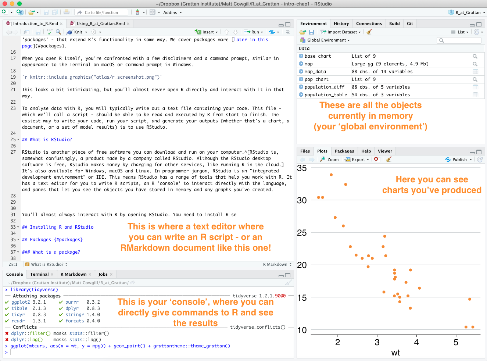
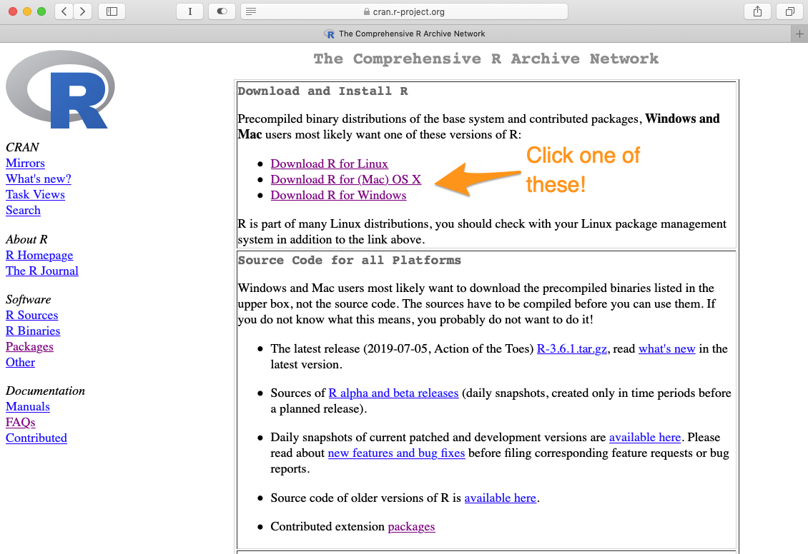

# (PART) What is R and why do we use it? {-}
# Introduction to R

Most people reading this guide will know what R is. But if you don't - that's OK! 

If you have used R before and are comfortable enough with it, you might want to skip to the next page. This page is intended for people who are unfamiliar with R. Soon, this will be you!

## What is R?

R is a programming language. *That sounds scarier than it really is!* Don't freak out. R is software you use to work with data, just like Excel, Stata, or SPSS. 

R is available for Windows, macOS and Linux. One of R's best features: it's free!

One of R's strengths is that it was designed by and for statisticians, data scientists, and other people who work with data. This can also be one of its weaknesses - statisticians aren't always the best at designing software that's easy to use out of the box. 

R has a lot in common with other statistical software like SAS, Stata, SPSS or Eviews. You can use those software packages to read data, manipulate it, generate summary statistics, estimate models, and so on. You can use R for all those things and more. Everything you can do in Excel, you can (and generally should!) do in R. (See [the next page](#why-script) for more on why we usually use R rather than Excel.)

You interact with R by writing code. This is a little different to Stata or SPSS (or Excel), which allow you to do at least part of your analyses by clicking on menus and buttons. This means the initial learning curve for R can be a little steeper than for something like SPSS, but there are great benefits to a code-based approach to data analysis (see [the next page for more on this](#why-script)).

R is quite old, having been first released publicly in 1995, but it's also growing and changing rapidly. A lot of developments in R come in the form of new add-on pieces of software - known as 'packages' - that extend R's functionality in some way. We cover packages more [later in this page](#packages). 

To analyse data with R, you will typically write out a text file containing code. This file - which we'll call a script - should be able to be read and executed by R from start to finish. Your script is like a recipe from a cookbook - it tells R all the steps that are needed to go from the raw ingredients (your data) to the finished product (the graphs or other finished product).

The easiest way to write your code, run your script, and generate your outputs (whether that's a chart, a document, or a set of model results) is to use RStudio.

## What is RStudio?

RStudio is another piece of free software you can download and run on your computer.^[RStudio is, somewhat confusingly, a product made by a company called RStudio. Although the RStudio desktop software is free, RStudio makes money by charging for other services, like running R in the cloud. When we refer to RStudio, we're referring to the desktop software unless we make it clear that we mean the company.] Like R itself, RStudio is available for Windows, macOS and Linux. 

In programmer jargon, RStudio is an "integrated development environment" or IDE. Translated to English, this means RStudio has a range of tools that help you work with R. It has a text editor for you to write R scripts, an R 'console' to interact directly with the language, and panes that let you see the objects you have stored in memory and any graphs you've created, among other things. 

```{r rstudio-screenshot1, echo=FALSE, out.width='100%'} 

```

You'll almost always interact with R by opening RStudio. 

## Installing R and RStudio

Although you'll usually work with R by opening RStudio, you need to install both R and RStudio separately. 

Install R by going to [CRAN](https://cran.r-project.org), the Comprehensive R Archive Network. CRAN is a community-run website that houses R itself as well as a broad range of R packages. 

```{r cran, echo = FALSE, out.width='100%'}

```

You want to download the latest base R release, as a 'binary'. Don't worry, you don't need to know what a binary is.

For macOS, the page will look like this:
```{r cran_mac2, echo = FALSE, out.width='100%'}
knitr::include_graphics("atlas/r_cran_macos.png")
```

For Windows, you'll need to click on the 'base' version, and then click again to start the download.

```{r cran_windows, echo = FALSE, out.width='100%'}
knitr::include_graphics("atlas/r_cran_windows_1.png")
knitr::include_graphics("atlas/r_cran_windows_2.png")
```

Once you've installed R, you'll need to install RStudio. Go to the [RStudio website and install the latest version](https://www.rstudio.com/products/rstudio/download/#download) of RStudio Desktop (open source license).

Once they're both installed, get started by opening RStudio. 

## Learning more about R

This guide will show you how to use R at Grattan. But it is not a comprehensive tool for learning R. The book [R For Data Science](https://r4ds.had.co.nz) by Garrett Grolemund and Hadley Wickham is a great resource that will help you go from being a beginner to being able to do real-world analysis. The book is available for free online. There's even an active [R for Data Science community online](https://www.rfordatasci.com) that shares tips and solutions to R problems.


## `#r_at_grattan`
A great way to learn about R is to ask a Grattan person! Pose a question in the `#r_at_grattan` channel in **Grattan Slack** and someone will be sure to answer it.

At Grattan, none of us is a programmer first and foremost. We're a motley crew of economists, lawyers, doctors, scientists and philosophers who have learned how to code so we can work with data. Don't feel bad if you don't know what you're doing yet -- we've all been there and are happy to help you get up to speed.