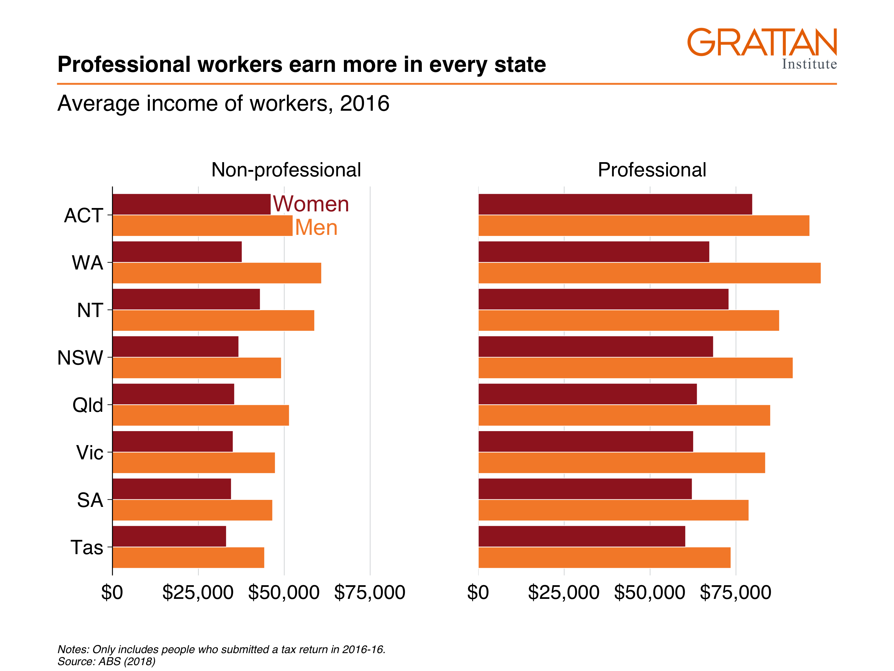
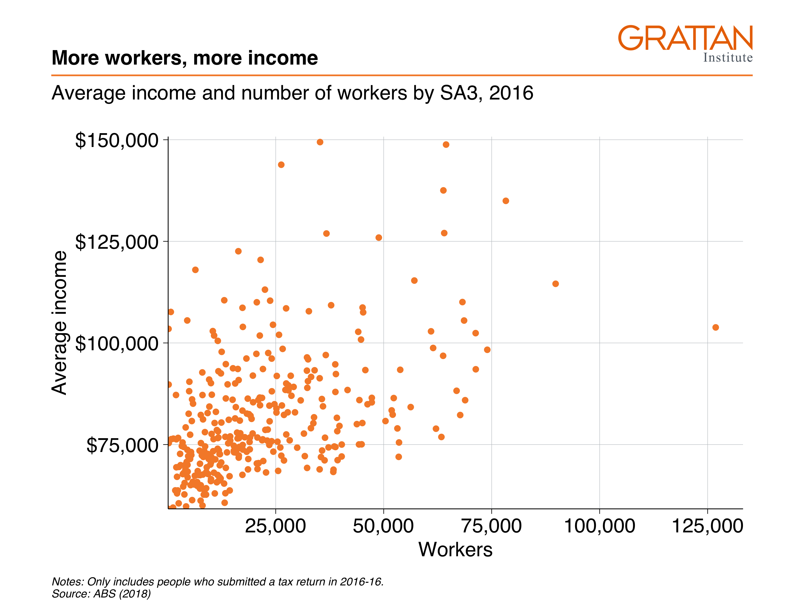
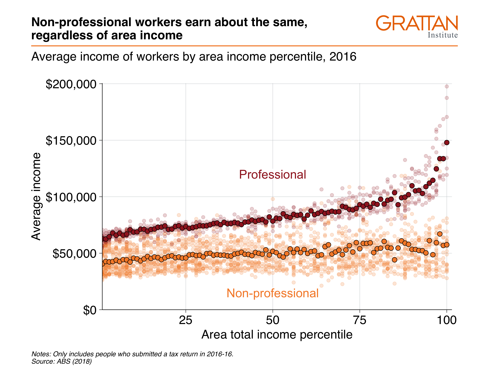

# Chart cookbook

This section takes you through a few often-used chart types. 


## Set up

```{r, include = FALSE}
# Load typesetting packages
library(knitr)

# Get dumb local functions
source("R/great_words.R")

# Set figure output to replicate type = "normal" 
knitr::opts_chunk$set(echo = TRUE, 
                      fig.width = 8.74, # inches
                      fig.height = 5.71) # inches


# Define function for coloured text:
col_text <- function(text, colour){
  outputFormat <- knitr::opts_knit$get("rmarkdown.pandoc.to")
  if(outputFormat == 'latex') {
    paste0("\\textcolor{", colour,"}{", text, "}")
  } else {
    paste0("<font color='",colour,"'>", text, "</font>")
  }
}


```


```{r load_packages, message = FALSE}
library(tidyverse)
library(grattantheme)
library(ggrepel)
library(absmapsdata)
library(sf)
library(scales)
library(janitor)
# this might be hairy; should get `grattools` happening:
library(grattan)
```


The `sa3_income` dataset will be used for all key examples in this chapter.^[From [ABS Employee income by occupation and sex, 2010-11 to 2016-16](https://www.abs.gov.au/AUSSTATS/abs@.nsf/DetailsPage/6524.0.55.0022011-2016?OpenDocument)] It is a long dataset from the ABS that contains the median income and number of workers by Statistical Area 3, occupation and sex between 2010 and 2016.

If you haven't already, download the `sa3_income.csv` file to your own `data` folder:

```{r download_data, eval = FALSE}
download.file(url = "https://raw.githubusercontent.com/grattan/R_at_Grattan/master/data/sa3_income.csv",
              destfile = "data/sa3_income.csv")
```

Then read it using the `read_csv` function, removing any rows missing average or median income values:

```{r read_data}
sa3_income <- read_csv("data/sa3_income.csv") %>% 
  filter(!is.na(median_income),
         !is.na(average_income))

head(sa3_income)
```


## Bar charts

Bar charts are made with `geom_bar` or `geom_col`. Creating a bar chart will look something like this:


```{r bar_eg, eval = FALSE}
ggplot(data = <data>) + 
  geom_bar(aes(x = <xvar>, y = <yvar>),
     stat = <STAT>, 
     position = <POSITION>
  )
```


It has two key arguments: `stat` and `position`. 

First, `stat` defines what kind of _operation_ the function will do on the dataset before plotting. Some options are:

- `"count"`, the **default**: count the number of observations in a particular group, and plot that number. This is useful when you're using microdata. When this is the case, there is no need for a `y` aesthetic.
- `"sum"`: sum the values of the `y` aesthetic.
- `"identity"`: directly report the values of the `y` aesthetic. This is how PowerPoint and Excel charts work.

You can use **`geom_col`** instead, as a shortcut for `geom_bar(stat = "identity)`. 

Second, `position`, dictates how multiple bars occupying the same x-axis position will positioned. The options are:

- `"stack"`, the default: bars in the same group are stacked atop one another.
- `"dodge"`: bars in the same group are positioned next to one another.
- `"fill"`: bars in the same group are stacked and all fill to 100 per cent.

### Simple bar plot

This section will create the following vertical bar plot showing number of workers by state in 2016:

```{r simple_bar_show, echo = FALSE}
include_graphics("atlas/simple_bar.png")
```

First, create the data you want to plot. 

```{r simple_bar_data}
data <- sa3_income %>% 
  filter(year == 2016) %>% 
  group_by(state) %>% 
  summarise(workers = sum(workers))

data
```

Looks `r great()`: you have one observation (row) for each state you want to plot, and a value for their number of workers.

Now pass the nice, simple table to `ggplot` and add aesthetics so that `x` represents `state`, and `y` represents `workers`. Then, because the dataset contains the _actual_ numbers you want on the chart, you can plot the data with `geom_col`:^[Remember that `geom_col` is just shorthand for `geom_bar(stat = "identity")`]

```{r simple_bar_base}
data %>% 
  ggplot(aes(x = state,
             y = workers)) + 
  geom_col()
```

Make it Grattany by adjusting general theme defaults with `theme_grattan`, and use `grattan_y_continuous` to change the y-axis. Use labels formatted with commas (rather than scientific notation) by adding `labels = comma`. 

```{r simple_bar_grattan}
data %>% 
  ggplot(aes(x = state,
             y = workers)) + 
  geom_col() + 
  theme_grattan() + 
  grattan_y_continuous(labels = comma)
```


To order the states by number of workers, you can tell the `x` aesthetic that you want to `reorder` the `state` variable by `workers`:

```{r simple_bar_reorder}
data %>% 
  ggplot(aes(x = reorder(state, workers), # reorder states by workers
             y = workers)) + 
  geom_col() + 
  theme_grattan() + 
  grattan_y_continuous(labels = comma)
```

You can probably drop the x-axis label -- people will understand that they're states without you explicitly saying it -- and add a title and subtitle with `labs`:


```{r simple_bar_title} 
simple_bar <- data %>% 
  ggplot(aes(x = reorder(state, workers),
             y = workers)) + 
  geom_col() + 
  theme_grattan() + 
  grattan_y_continuous(labels = comma) + 
  labs(title = "Most workers are on the east coast",
       subtitle = "Number people in employment, 2016",
       x = "",
       caption = "Notes: Only includes people who submitted a tax return in 2016-16. Source: ABS (2018)")

simple_bar
```

Looks `r great()`! Now you can export as a full-slide Grattan chart using `grattan_save`:

```{r simple_bar_save_pdf, eval = FALSE}
grattan_save("atlas/simple_bar.pdf", simple_bar, type = "fullslide")
```

```{r simple_bar_save_png, include = FALSE}
grattan_save("atlas/simple_bar.png", simple_bar, type = "fullslide")
```

```{r simple_bar_include, echo = FALSE}
include_graphics("atlas/simple_bar.png")
```


### Bar plot with multiple series {#bar-multi}

This section will create a horizontal bar plot showing average income by state and gender in 2016:

```{r bar_multi_show, include=FALSE}
include_graphics("atlas/multiple_bar.png")
```

First create the dataset you want to plot, getting the average income by state and gender in the year 2016:

```{r bar_multi_data}
data <- sa3_income %>% 
  filter(year == 2016) %>%   
  group_by(state, gender) %>%   
  summarise(average_income = sum(total_income) / sum(workers))

data
```

Looks `r great()`: you have one observation (row) for each state $\times$ gender group you want to plot, and a value for their average income. Put `state` on the x-axis, `average_income` on the y-axis, and split gender by fill-colour (`fill`).


Pass the data to `ggplot`, give it the appropriate `x` and `y` aesthetics, along with `fill` (the fill colour^[The aesthetic `fill` represents the 'fill' colour -- the colour that fills the bars in your chart. The `colour` aesthetic controls the colours of the _lines_.]) representing `gender`. And because you have the _actual_ values for `average_income` you want to plot, use `geom_col`:^[`geom_col` is shorthand for `geom_bar(stat = "identity"`] 

```{r bar_multi_base}
data %>% 
  ggplot(aes(x = state,
             y = average_income,
             fill = gender)) + 
  geom_col()
```

The two series -- women and men -- created by `fill` are stacked on-top of each other by `geom_col`. You can tell it to plot them next to each other -- to 'dodge' -- instead with the `position` argument _within_ `geom_col`:

```{r bar_multi_dodge}
data %>% 
  ggplot(aes(x = state,
             y = average_income,
             fill = gender)) + 
  geom_col(position = "dodge") # 'dodge' the series
```

To flip the chart -- a useful move when you have long labels -- add `coord_flip` (ie 'flip the x and y coordinates of the chart'). 

However, while the _coordinates_ have been flipped, the underlying data hasn't. If you want to refer to the `average_income` axis, which now lies horizontally, you would still refer to the `y` axis (eg `grattan_y_continuous` still refers to your `y` aesthetic, `average_income`). 

```{r bar_multi_flip}
data %>% 
  ggplot(aes(x = state,
             y = average_income,
             fill = gender)) + 
  geom_col(position = "dodge") + 
  coord_flip() # rotate the chart
```

And reorder the states by average income, so that the state with the highest (combined) average income is at the top. This is done with the `reorder(var_to_reorder, var_to_reorder_by)` function when you define the `state` aesthetic:

```{r bar_multi_reorder}
data %>% 
  ggplot(aes(x = reorder(state, average_income), # reorder
             y = average_income,
             fill = gender)) + 
  geom_col(position = "dodge") + 
  coord_flip()
```

Wonderful -- that's how you want our _data_ to look. Now you can Grattanise it. Note that `theme_grattan` needs to know that the coordinates were flipped so it can apply the right settings. Also tell `grattan_fill_manual` that there are two fill series. 

```{r bar_multi_grattan}
data %>% 
  ggplot(aes(x = reorder(state, average_income), 
             y = average_income,
             fill = gender)) + 
  geom_col(position = "dodge") + 
  coord_flip() + 
  theme_grattan(flipped = TRUE) + # grattan theme
  grattan_y_continuous(labels = dollar) + # y axis
  grattan_fill_manual(2) # grattan fill colours
```

You can use `grattan_label` to **label your charts** in the Grattan style. This function is a 'wrapper' around `geom_label` that has settings that we tend to like: white background with a thin margin, 18-point font, and no border. It takes the [standard arguments of `geom_label`](https://ggplot2.tidyverse.org/reference/geom_text.html). 

Section \@ref(adding-labels) shows how labels are treated like data points: they need to know where to go (`x` and `y`) and what to show (`label`). But if you provide _every point_ to your labelling `geom`, it will plot every label:


```{r bar_multi_label_all}
data %>% 
  ggplot(aes(x = reorder(state, average_income), 
             y = average_income,
             fill = gender)) + 
  geom_col(position = "dodge") + 
  coord_flip() + 
  theme_grattan(flipped = TRUE) + 
  grattan_y_continuous(labels = dollar) + 
  grattan_fill_manual(2) + 
  grattan_label(aes(colour = gender,  # colour the text according to gender
                    label = gender),  # label the text according to gender
            position = position_dodge(width = 1),  # position dodge with width 1
            hjust = -0.1) +  # horizontally align the label so its outside the bar
  grattan_colour_manual(2)   # define colour as two grattan colours
```

To just label _one_ of the plots -- ie the first one, ACT in this case -- we need to tell `grattan_label`. The easiest way to do this is by **creating a label dataset beforehand**, like `label_gender` below. This just includes the observations you want to label:


```{r bar_multi_label_data}
label_gender <- data %>% 
  filter(state == "ACT")  # just want Tasmania observations

label_gender
```

So you can pass that `label_gender` dataset to `grattan_label`:

```{r bar_multi_label}
data %>% 
  ggplot(aes(x = reorder(state, average_income), 
             y = average_income,
             fill = gender)) + 
  geom_col(position = "dodge") + 
  coord_flip() + 
  theme_grattan(flipped = TRUE) + 
  grattan_y_continuous(labels = dollar) + 
  grattan_fill_manual(2) + 
  grattan_label(data = label_gender,  # supply the new dataset
                aes(colour = gender,
                    label = gender), 
                position = position_dodge(width = 1), 
                hjust = -0.1) + 
  grattan_colour_manual(2)
```

Almost there! The labels go out of range a little bit, and we can fix this by expanding the plot:

```{r bar_multi_expand}
data %>% 
  ggplot(aes(x = reorder(state, average_income),
             y = average_income,
             fill = gender)) + 
  geom_col(position = "dodge") + 
  coord_flip() + 
  theme_grattan(flipped = TRUE) + 
  grattan_y_continuous(labels = dollar, 
                       expand_top = .1) + # expand the plot
  grattan_fill_manual(2) + 
  grattan_label(data = label_gender,
                aes(colour = gender,
                    label = gender), 
                position = position_dodge(width = 1), 
                hjust = -0.1) + 
  grattan_colour_manual(2)
```

Looks `r great()`! Now you can add titles and a caption, and save using `grattan_save`:

```{r bar_multi_final}
multiple_bar <- data %>% 
  ggplot(aes(x = reorder(state, average_income), 
             y = average_income,
             fill = gender)) + 
  geom_col(position = "dodge") + 
  coord_flip() + 
  theme_grattan(flipped = TRUE) + 
  grattan_y_continuous(labels = dollar, 
                       expand_top = .1) + 
  grattan_fill_manual(2) + 
  grattan_label(data = label_gender, 
                aes(colour = gender,
                    label = gender), 
                position = position_dodge(width = 1), 
                hjust = -0.1) + 
  grattan_colour_manual(2) + 
  labs(title = "Women earn less than men in every state",
       subtitle = "Average income of workers, 2016",
       x = "",
       y = "",
       caption = "Notes: Only includes people who submitted a tax return in 2016-16. Source: ABS (2018)")

```

```{r bar_multi_save_pdf, eval = FALSE}
grattan_save("atlas/multiple_bar.pdf", multiple_bar, type = "fullslide")
```

```{r bar_multi_save_png, include = FALSE}
grattan_save("atlas/multiple_bar.png", multiple_bar, type = "fullslide")
```

```{r bar_multi_include, echo = FALSE}
include_graphics("atlas/multiple_bar.png")
```


### Facetted bar charts {#facet-bar}

'Facetting' a chart means you create a separate plot for each group. It's particularly useful in showing differences between more than one group. The chart you'll make in this section will show annual income by gender and state, _and_ by professional and non-professional workers:

```{r bar_facet_show, include=FALSE}

```

Start by creating the dataset you want to plot:

```{r bar_facet_data}
data <- sa3_income %>% 
  group_by(state, gender, prof) %>% 
  summarise(average_income = sum(total_income) / sum(workers))

data
```

Then plot a bar chart with `geom_col` and `theme_grattan` elements, using a similar chain to the final plot of \@ref(bar-multi) (without the labelling). We'll build on this chart:

```{r bar_facet_base}
facet_bar <- data %>% 
  ggplot(aes(x = reorder(state, average_income),
             y = average_income,
             fill = gender)) + 
  geom_col(position = "dodge") + 
  coord_flip() + 
  theme_grattan(flipped = TRUE) + 
  grattan_y_continuous(labels = dollar, 
                       expand_top = .1) + 
  grattan_fill_manual(2) + 
  grattan_colour_manual(2) + 
  labs(title = "Professional workers earn more in every state",
       subtitle = "Average income of workers, 2016",
       x = "",
       y = "",
       caption = "Notes: Only includes people who submitted a tax return in 2016-16. Source: ABS (2018)")

```


You can 'facet' bar charts -- and any other chart type -- with the `facet_grid` or `facet_wrap` commands. The latter tends to give you more control over label placement, so let's start with that. `fadcet_wrap` asks the questions: "what variables should I create separete charts for", and "how should I place them on the page"? Tell it to use the `prof` variable with the `vars()` function.^[The `vars()` function is sometimes used in the `tidyverse` to specifically say "I am using a variable name here". You can't use variable names directly because of legacy issues. You can learn more about it in the [official documentation](https://ggplot2.tidyverse.org/reference/facet_wrap.html).]


```{r bar_facet_wrap}
facet_bar +
  facet_wrap(vars(prof))
```

That's good! It does what it should. Now you just need to tidy it up a little bit by adding labels and avoiding clashes along the bottom axis.

Create labels in the same way you have done before: you only want to label one 'women' and 'men' series, so create a dataset that contains only that information:

```{r bar_facet_label_data}
label_data <- data %>% 
  filter(state == "ACT",
         prof == "Non-professional")

label_data
```

Good -- now add that to the plot with `grattan_label`, supplying the required aesthetics and position. And use `hjust = 0` to tell the labels to be left-aligned.

To give each plot a black base axis, you can add `geom_hline()` with `yintercept = 0`. 

```{r bar_facet_label, message = FALSE}
facet_bar +
  facet_wrap(vars(prof)) + 
  geom_hline(yintercept = 0) +  # add black line
  grattan_label(data = label_data, # supply label data
                aes(label = gender,
                    colour = gender),
                position = position_dodge(width = 1), 
                hjust = 0)
  
```

`r Great()`! But the "\$0" and "\$100,000" labels are clashing along the horizontal axis. To tidy these up, we redefine the `breaks` -- the points that will be labelled -- to 25,000, 50,000 and 75,000 inside `grattan_y_continuous`. Putting everything together and saving the plot as a fullslide chart with `grattan_save`:

```{r bar_facet_final}
# Create label data
label_data <- data %>% 
  filter(state == "ACT",
         prof == "Non-professional")

# Create plot
facet_bar <- data %>% 
  ggplot(aes(x = reorder(state, average_income),
             y = average_income,
             fill = gender)) + 
  geom_col(position = "dodge") + 
  coord_flip() + 
  theme_grattan(flipped = TRUE) + 
  grattan_y_continuous(labels = dollar,
                       breaks = c(25e3, 50e3, 75e3)) +  # change breaks
  grattan_fill_manual(2) + 
  grattan_colour_manual(2) + 
  labs(title = "Professional workers earn more in every state",
       subtitle = "Average income of workers, 2016",
       x = "",
       y = "",
       caption = "Notes: Only includes people who submitted a tax return in 2016-16. Source: ABS (2018)") + 
  facet_wrap(vars(prof)) + 
  grattan_label(data = label_data,
                aes(label = gender,
                    colour = gender),
                position = position_dodge(width = 1), 
                hjust = 0)

```


```{r bar_facet_save_pdf, eval = FALSE}
grattan_save("atlas/facet_bar.pdf", facet_bar, type = "fullslide")
```

```{r bar_facet_save_png, include = FALSE}
grattan_save("atlas/facet_bar.png", facet_bar, type = "fullslide")
```

```{r bar_facet_include, echo = FALSE}

```


## Line charts

A line chart has one key aesthetic: `group`. This tells `ggplot` how to connect individual lines. 

### Simple line chart

The first line chart shows the number of workers in Australia between 2011 and 2016:

```{r simple_line_show, echo = FALSE}
# include_graphics()
```


### Line chart with multiple series
This line chart will show how **real** average income has changed for each state over the past five years:

```{r multi_line_show, echo = FALSE}
# include_graphics()
```

First, take the `sa3_income` dataset and create a summary table average income by year and state. Ignore the territories for this chart.

```{r line_basedata, message = FALSE}
data <- sa3_income %>% 
  filter(!state %in% c("ACT", "NT")) %>% 
  group_by(year, state) %>% 
  summarise(average_income = sum(total_income) / sum(workers))

head(data)
```

The income data presented is nominal, so you'll need to inflate to 'real' dollars using the `cpi_inflate

Plot a line chart by taking the `data`, passing it to `ggplot` with  *aes*thetics, then using `geom_line`:

```{r, line1_nocol}
data %>% 
  ggplot(aes(x = year,
             y = average_income,
             group = state)) + 
  geom_line()
```


Now you can represent each `state` by colour:

```{r, line1_wcol}
data %>% 
  ggplot(aes(x = year,
             y = average_income,
             group = state,
             colour = state)) + 
  geom_line()
```

Cooler! Adding some Grattan formatting to it and define it as our 'base chart':

```{r}
base_chart <-data %>% 
  ggplot(aes(x = year,
             y = average_income,
             group = state,
             colour = state)) + 
  geom_line() +
  theme_grattan() + 
  grattan_y_continuous(labels = comma) + 
  grattan_colour_manual(6) +
  labs(x = "",
       y = "")

base_chart
```


You can add 'dots' for each year by layering `geom_point` on top of `geom_line`:

```{r line2, message = FALSE}
base_chart +
  geom_point()
```

To add labels to the end of each line, you would expand the x-axis to make room for labels and add reasonable breaks:

```{r line_expand, message = FALSE}
base_chart +
  grattan_x_continuous(expand_right = .3,
                       breaks = seq(2011, 2016, 1),
                       labels = c("2011", "12", "13", "14", "15", "16")) 
```

Then add labels, using 

```{r line_label, message = FALSE}
label_line <- data %>% 
  filter(year == 2010)

base_chart +
  geom_point() +
  grattan_x_continuous(expand_left = .1,
                       breaks = seq(2011, 2016, 1),
                       labels = c("2011", "12", "13", "14", "15", "16")) + 
  grattan_label(data = label_line,
                aes(label = state),
                nudge_x = -Inf,
                segment.colour = NA)

```
If you wanted to show each state individually, you could **facet** your chart so that a separate plot was produced for each state:

```{r line3, message = FALSE}
base_chart +
  geom_point() +
    grattan_x_continuous(expand_left = .1, 
                         expand_right = .1,
                         breaks = seq(2011, 2016, 1),
                         labels = c("2011", "12", "13", "14", "15", "16")) + 
  theme(panel.spacing.x = unit(10, "mm")) + 
  facet_wrap(state ~ .)
```


## Scatter plots

Scatter plots require `x` and `y` aesthetics. These can then be coloured and faceted.


### Simple scatter plot

The first simple scatter plot will show the relationship between average incomes of professionals and the number of professional workers by area in 2016:

```{r simple_scatter_show}

```

Create the dataset you want to plot:

```{r simple_scatter_data}
data <- sa3_income %>% 
  filter(year == 2016,
         prof == "Professional") %>% 
  group_by(sa3_name) %>% 
  summarise(workers = sum(workers),
            average_income = sum(total_income) / workers)

head(data)
```

The dataset has one observation per SA3, and the two variables you want to plot: workers and average income. Pass the data to `ggplot`, set the aesthetics and plot with `geom_point`:

```{r simple_scatter_base}
data %>% 
  ggplot(aes(x = workers,
             y = average_income)) + 
  geom_point()
```

Then add Grattan theme elements:

- `theme_grattan()`, telling it that the `chart_type` is a scatter plot.
- `grattan_y_continuous()`, setting the label style to `dollar`. 
- `grattan_x_continuous()`, setting the label style to `comma`. 


```{r simple_scatter_grattan}
data %>% 
  ggplot(aes(x = workers,
             y = average_income)) + 
  geom_point()  +
  theme_grattan(chart_type = "scatter") + 
  grattan_y_continuous(labels = dollar) + 
  grattan_x_continuous(labels = comma)

```

Looks `r great()`. The last label on the x-axis goes off the page a bit so you can expand the plot to the right in the `grattan_x_continuous` element:

```{r simple_scatter_expand}
data %>% 
  ggplot(aes(x = workers,
             y = average_income)) + 
  geom_point()  +
  theme_grattan(chart_type = "scatter") + 
  grattan_y_continuous(labels = dollar) + 
  grattan_x_continuous(labels = comma,
                       expand_right = .05) # expand the right by 5%
```

Finally, add titles and save the plot:

```{r simple_scatter_titles}
simple_scatter <- data %>% 
  ggplot(aes(x = workers,
             y = average_income)) + 
  geom_point()  +
  theme_grattan(chart_type = "scatter") + 
  grattan_y_continuous(labels = dollar) + 
  grattan_x_continuous(labels = comma,
                       expand_right = .05) + 
  labs(title = "More workers, more income",
       subtitle = "Average income and number of workers by SA3, 2016",
       y = "Average income",
       x = "Workers",
       caption = "Notes: Only includes people who submitted a tax return in 2016-16. Source: ABS (2018)")
```


```{r simple_scatter_save_pdf, eval = FALSE}
grattan_save("atlas/simple_scatter.pdf", simple_scatter, type = "fullslide")
```

```{r simple_scatter_save_png, include = FALSE}
grattan_save("atlas/simple_scatter.png", simple_scatter, type = "fullslide")
```

```{r simple_scatter_include, echo = FALSE}

```


### Scatter plot with reshaped data

The next scatter plot involves the same basic plotting principles of the chart above, but requires a bit more data manipulation before plotting.

The chart will show the wages of professional workers and non-professional workers in 2016:

```{r scatter_reshape_show}
include_graphics("atlas/scatter_reshape.png")
```

First prepare your data. You want to find the average incomes of all professional and non-professional workers in 2016:

```{r scatter_reshape_data_prep}
data_prep <- sa3_income %>% 
  filter(year == 2016) %>% 
  group_by(sa3_name, prof) %>% 
  summarise(average_income = sum(total_income) / sum(workers))

head(data_prep)
```

That's good -- you have the numbers you need. But think about how you're going to _plot_ them using `x` and `y` aesthetics. You'll need one variable for `x = professional_income` and one variable for `y = non_professional_income`. At the moment, these are represented by different _rows_. 

You can fix this by reshaping the data with the `pivot_wider` function. The three arguments you provide here are:

- `id_cols = sa3_name`: the variable `sa3_name` uniquely identifies each row in your data.
- `names_from = prof`: the variable `prof` contains the variables names for the _new_ variables you are creating.
- `values_from = average_income`: the variable `average_income` contains the _values_ that will fill the new variables.

After the `pivot_wider` step is complete, use `janitor::clean_names()` to convert the new `Professional` and `Non-Professional` names to `snake_case` to make them easier to use down the track:

```{r scatter_reshape_data}
data <- data_prep %>% 
  pivot_wider(id_cols = sa3_name,  # variables that will stay the same
              names_from = prof,   # variables that will dictate the new names
              values_from = average_income) %>%  # these will be the values
  janitor::clean_names() # tidy up the new variable names

head(data)
```

Getting the data in the right format for your plot -- rather than 'hacking' your plot to fit your data -- will save you time and effort down the line. 

Now you have a dataset in the format you want to plot, you can pass it to `ggplot` and add aesthetics like you normally would. 

```{r scatter_reshape_base, message = FALSE}
data %>% 
  ggplot(aes(x = non_professional,
             y = professional)) + 
  geom_point(alpha = 0.8) # make the points a little transparent
```

Then, like you've done before, add Grattan theme elements and titles, and save with `grattan_save`:

```{r scatter_reshape_grattan}
scatter_reshape <- data %>% 
  ggplot(aes(x = non_professional,
             y = professional)) + 
  geom_point(alpha = 0.8) + 
  theme_grattan(chart_type = "scatter") + 
  grattan_y_continuous(labels = dollar) + 
  grattan_x_continuous(labels = dollar) +
  labs(title = "Non-professionals tend to earn more when professionals do",
       subtitle = "Average income for workers by SA3, 2016",
       y = "Professional incomes",
       x = "Non-professional incomes",
       caption = "Notes: Only includes people who submitted a tax return in 2016-16. Source: ABS (2018)")
```


```{r scatter_reshape_save_pdf, eval = FALSE}
grattan_save("atlas/scatter_reshape.pdf", scatter_reshape, type = "fullslide")
```

```{r scatter_reshape_save_png, include = FALSE}
grattan_save("atlas/scatter_reshape.png", scatter_reshape, type = "fullslide")
```

```{r scatter_reshape_include, echo = FALSE}
include_graphics("atlas/scatter_reshape.png")
```


### Layered scatter plot 

For the third plot, look at the incomes of non-professional workers by their area's total income percentile:

```{r scatter_layer_show}

```

Get the data you want to plot:

```{r scatter_layer_data, message = FALSE}
data <- sa3_income %>% 
  filter(year == 2016) %>%
  mutate(total_income = average_income * workers) %>% 
  group_by(sa3_name, sa3_income_percentile, prof, occ_short) %>% 
  summarise(income = sum(total_income),
            workers = sum(workers),
            average_income = income / workers)

head(data)
```

To make a scatter plot with `average_income` against `sa3_income_percentile`, pass the `income` dataset to `ggplot`, add `x = sa3_income_percentile`, `y = average_income` and `colour = gender` aesthetics, then plot it with `geom_point`. Tell `geom_point` to reduce the opacity with `alpha = 0.2`, as these individual points are more of the 'background' to the plot:


```{r scatter_layer_prep}
data %>% 
  ggplot(aes(x = sa3_income_percentile,
             y = average_income,
             colour = prof)) +
  geom_point(alpha = 0.2)
```


Now add your Grattan theme elements: 

- `theme_grattan()`, telling it that the `chart_type` is a scatter plot.
- `grattan_colour_manual()` with `2` colours.
- `grattan_y_continuous()`, setting the label style to `dollar`. Also tell the plot to start at zero by setting `limits = c(0, NA)` (lower, upper limits, with `NA` representing 'choose automatically'). Note that starting at zero isn't a requirement for scatter plots, but here it will give you some breathing space for your labels.
- `grattan_x_continuous()`. 


```{r scatter_layer_base}
base_chart <- data %>% 
  ggplot(aes(x = sa3_income_percentile,
             y = average_income,
             colour = prof)) +
  geom_point(alpha = 0.2) + 
  theme_grattan(chart_type = "scatter") + 
  grattan_colour_manual(2) + 
  grattan_y_continuous(labels = dollar, 
                       limits = c(0, NA)) + 
  grattan_x_continuous()

base_chart
```

Looks `r great()`! To make the point a little clearer, we can overlay a point for average income each percentile. Create a dataset that has the average income for each area and professional work category:

```{r scatter_layer_perc}
perc_average <- data %>% 
  group_by(prof, sa3_income_percentile) %>% 
  summarise(average_income = sum(income) / sum(workers))

head(perc_average)
```

Then layer this on your plot by adding another `geom_point` and providing the `perc_average` data. Add a `fill` aesthetic and change the shape to `21`: a circle with a border (controlled by `colour`) and fill colour (controlled by `fill`).^[See the full list of shapes [here](https://ggplot2.tidyverse.org/reference/scale_shape.html).]
Make the outline of the circle black with `colour` and make the `size` a little bigger:

```{r scatter_layer_add_perc}
base_chart +
  geom_point(data = perc_average,
             aes(fill = prof),
             shape = 21,
             size = 3, 
             colour = "black") + 
  grattan_fill_manual(2)
```

To add labels, first decide where they should go. Try positioning the "Professional" above its averages, and "Non-professional" at the bottom. 

Like labelling before, you should create a new dataset with your label information, and pass that label dataset to the `grattan_label` function:

```{r scatter_layer_label_data}

label_data <- tibble(
  sa3_income_percentile = c(50, 50),
  average_income = c(15e3, 120e3),
  prof =  c("Non-professional", "Professional"))

```

Finally, add the labels to the plot and give some titles:

```{r scatter_layer_label}
base_chart +
  geom_point(data = perc_average,
             aes(fill = prof),
             shape = 21,
             size = 3, 
             colour = "black") + 
  grattan_fill_manual(2) + 
  grattan_label(data = label_data,
                aes(label = prof)) + 
  labs(title = "Non-professional workers earn about the same, regardless of area income",
       subtitle = "Average income of workers by area income percentile, 2016",
       x = "Area total income percentile",
       y = "Average income",
       caption = "Notes: Only includes people who submitted a tax return in 2016-16. Source: ABS (2018)")
```

Putting that all together, your code will look something like this:

```{r scatter_layer_all}

# Create percentage data
perc_average <- data %>% 
  group_by(prof, sa3_income_percentile) %>% 
  summarise(average_income = sum(income) / sum(workers))

# Create label data
label_data <- tibble(
  sa3_income_percentile = c(50, 50),
  average_income = c(15e3, 120e3),
  prof =  c("Non-professional", "Professional"))


# Plot 
scatter_layer <- data %>% 
  ggplot(aes(x = sa3_income_percentile,
             y = average_income,
             colour = prof)) +
  geom_point(alpha = 0.2) + 
  theme_grattan(chart_type = "scatter") + 
  grattan_colour_manual(2) + 
  grattan_y_continuous(labels = dollar, 
                       limits = c(0, NA)) + 
  grattan_x_continuous() + 
  geom_point(data = perc_average,
             aes(fill = prof),
             shape = 21,
             size = 3, 
             colour = "black") + 
  grattan_fill_manual(2) + 
  grattan_label(data = label_data,
                aes(label = prof)) + 
  labs(title = "Non-professional workers earn about the same, regardless of area income",
       subtitle = "Average income of workers by area income percentile, 2016",
       x = "Area total income percentile",
       y = "Average income",
       caption = "Notes: Only includes people who submitted a tax return in 2016-16. Source: ABS (2018)")

```


```{r scatter_layer_save_pdf, eval = FALSE}
grattan_save("atlas/scatter_layer.pdf", scatter_layer, type = "fullslide")
```

```{r scatter_layer_save_png, include = FALSE}
grattan_save("atlas/scatter_layer.png", scatter_layer, type = "fullslide")
```

```{r scatter_layer_include, echo = FALSE}

```


### Scatter plots with trendlines

### Facetted scatter plots


## Distributions

`geom_histogram`
`geom_density`

`ggridges::`


## Maps

### `sf` objects
[what is]

### Using `absmapsdata`

The `absmapsdata` contains compressed, and tidied `sf` objects containing geometric information about ABS data structures. The included objects are:

  - Statistical Area 1 2011 and 2016: `sa12011` or `sa12016`
  - Statistical Area 2 2011 and 2016: `sa22011` or `sa22016`
  - Statistical Area 3 2011 and 2016: `sa32011` or `sa32016`
  - Statistical Area 4 2011 and 2016: `sa42011` or `sa42016`
  - Greater Capital Cities 2011 and 2016: `gcc2011` or `gcc2016`
  - Remoteness Areas 2011 and 2016: `ra2011` or `ra2016`
  - State 2011 and 2016: `state2011` or `state2016`
  - Commonwealth Electoral Divisions 2018: `ced2018`
  - State Electoral Divisions 2018:`sed2018`
  - Local Government Areas 2016 and 2018: `lga2016` or `lga2018`
  - Postcodes 2016: `postcodes2016`

The package is [hosted on Github](https://github.com/wfmackey/absmapsdata) and can be installed with `remotes::install_github()`

```{r install_absmapsdata, eval = FALSE}
remotes::install_github("wfmackey/absmapsdata")
library(absmapsdata)
```

You will also need the `sf` package installed to handle the `sf` objects:

```{r install_sf, eval = FALSE}
install.packages("sf")
library(sf)
```

Now you can view `sf` objects stored in `absmapsdata`:

```{r}
glimpse(sa32016)
```


### Making choropleth maps

Choropleth maps break an area into 'bits', and colours each 'bit' according to a variable.

You can join the `sf` objects from `absmapsdata` to your dataset using `left_join`. The variable names might be different -- eg `sa3_name` compared to `sa3_name_2016` -- so use the `by` argument to match them.

First, take the `sa3_income` dataset and join the `sf` object `sa32016` from `absmapsdata`:

```{r make_map_data, message = FALSE}
map_data <- sa3_income %>% 
  left_join(sa32016, by = c("sa3_name" = "sa3_name_2016"))

```

You then plot a map like you would any other `ggplot`: provide your data, then choose your `aes` and your `geom`. For maps with `sf` objects, the **key aesthetic** is `geometry = geometry`, and the **key geom** is `geom_sf`.

The argument `lwd` controls the line width of area borders.

Note that RStudio takes a long time to render a map in the 


```{r map1}

```

Showing all of Australia on a single map is difficult: there are enormous areas that are home to few people which dominate the space. Showing individual states or capital city areas can sometimes be useful. 

To do this, filter the `map_data` object: 

```{r map_filter}

```


#### Adding labels to maps

You can add labels to choropleth maps with the standard `geom_text` or `geom_label`. Because it is likely that some labels will overlap, `ggrepel::geom_text_repel` or `ggrepel::geom_label_repel` is usually the better option.

To use `geom_(text|label)_repel`, you need to tell `ggrepel` where in 


```{r map_label, warning = FALSE, eval = FALSE}
map <- map_data %>% 
        filter(state == "Vic") %>% 
        ggplot(aes(geometry = geometry)) +
        geom_sf(aes(fill = pop_change),
                lwd = .1,
                colour = "black") +
        theme_void() +
        grattan_fill_manual(discrete = FALSE, 
                            palette = "diverging",
                            limits = c(-20, 20),
                            breaks = seq(-20, 20, 10)) +
  geom_label_repel(aes(label = sa3_name),
                  stat = "sf_coordinates", nudge_x = 1000, segment.alpha = .5,
                  size = 4, 
                  direction = "y",
                  label.size = 0, 
                  label.padding = unit(0.1, "lines"),
                  colour = "grey50",
                  segment.color = "grey50") + 
  scale_y_continuous(expand = expand_scale(mult = c(0, .2))) + 
  theme(legend.position = "top") + 
  labs(fill = "Population \nchange")

map
```


## Creating simple interactive graphs with `plotly`

`plotly::ggplotly()`


