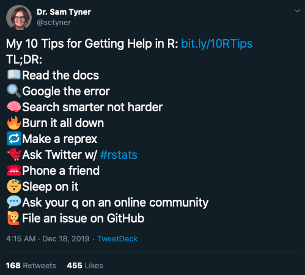

# Seeking help and using other resources {#seeking-help}

The most important skill you need to learn to use R well is how to get help. This is a great list of steps to try:

[This blog post](https://sctyner.github.io/rhelp.html) explains those steps at a bit more length.

The most important step is often breaking your problem down into a small, reproducible example - a `reprex` in R jargon. Often, the process of making a reprex can make your problem appear more clearly to you, so you'll solve it yourself before you even have to ask someone else!

## Using the `#r_at_grattan` Slack channel
A great way to learn about R is to ask a Grattan person! Pose a question in the `#r_at_grattan` channel in **Grattan Slack** and someone will be sure to answer it.

At Grattan, none of us is a programmer first and foremost. We're a motley crew of economists, lawyers, doctors, scientists and philosophers who have learned how to code so we can work with data. Don't feel bad if you don't know what you're doing yet -- we've all been there and are happy to help you get up to speed.

## Google, blogs, StackOverflow

_insert: A guide to Googling well_

## Learning more about R

This guide will show you how to use R at Grattan. But it is not a comprehensive tool for learning R. The book [R For Data Science](https://r4ds.had.co.nz) by Garrett Grolemund and Hadley Wickham is a great resource that will help you go from being a beginner to being able to do real-world analysis. The book is available for free online. There's even an active [R for Data Science community online](https://www.rfordatasci.com) that shares tips and solutions to R problems.
