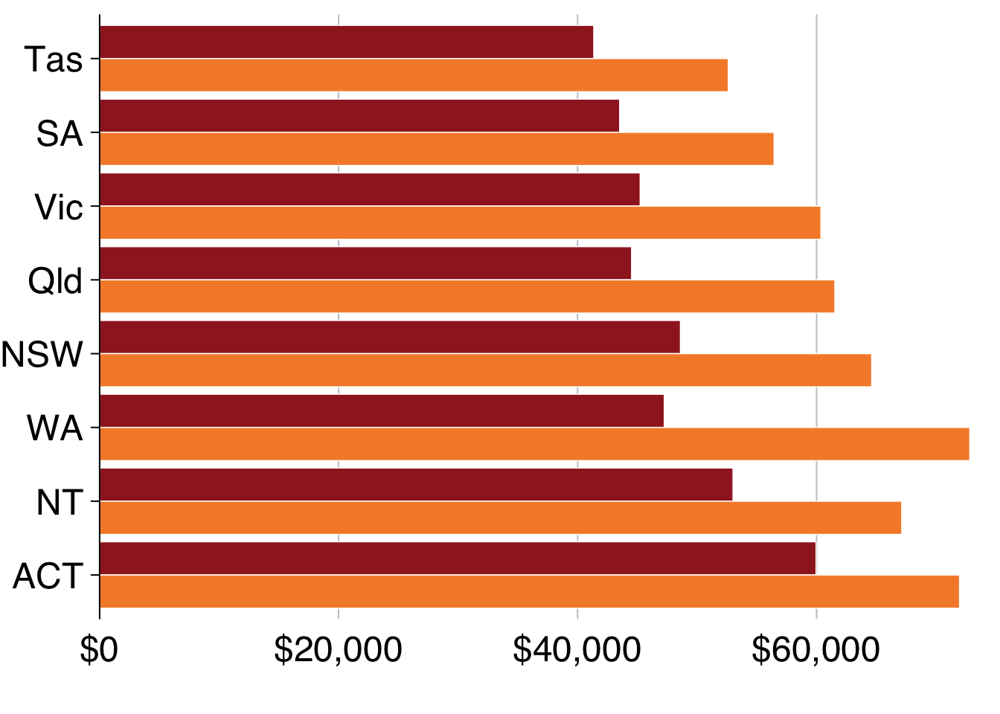

# Chart cookbook

This section takes you through a few often-used chart types. 


## Set up


```r
library(tidyverse)
library(grattantheme)
library(ggrepel)
library(absmapsdata)
library(sf)
library(scales)
library(ggfittext)
```

The `sa3_income` dataset will be used for all key examples in this chapter.^[From [ABS Employee income by occupation and sex, 2010-11 to 2015-16](https://www.abs.gov.au/AUSSTATS/abs@.nsf/DetailsPage/6524.0.55.0022011-2016?OpenDocument)] It is a long dataset from the ABS that contains the median income and number of workers by Statistical Area 3, occupation and sex between 2010 and 2015.


```r
sa3_income <- read_csv("data/sa3_income.csv") %>% 
  filter(!is.na(median_income),
         !is.na(average_income))
```

```
## Parsed with column specification:
## cols(
##   sa3 = col_double(),
##   sa3_name = col_character(),
##   sa3_sqkm = col_double(),
##   sa4_name = col_character(),
##   gcc_name = col_character(),
##   state = col_character(),
##   occupation = col_character(),
##   occ_short = col_character(),
##   gender = col_character(),
##   year = col_double(),
##   median_income = col_double(),
##   average_income = col_double(),
##   workers = col_double()
## )
```

```r
head(sa3_income)
```

```
## # A tibble: 6 x 13
##     sa3 sa3_name sa3_sqkm sa4_name gcc_name state occupation occ_short
##   <dbl> <chr>       <dbl> <chr>    <chr>    <chr> <chr>      <chr>    
## 1 10102 Queanbe…    6511. Capital… Rest of… NSW   Clerical … Admin    
## 2 10102 Queanbe…    6511. Capital… Rest of… NSW   Clerical … Admin    
## 3 10102 Queanbe…    6511. Capital… Rest of… NSW   Clerical … Admin    
## 4 10102 Queanbe…    6511. Capital… Rest of… NSW   Clerical … Admin    
## 5 10102 Queanbe…    6511. Capital… Rest of… NSW   Clerical … Admin    
## 6 10102 Queanbe…    6511. Capital… Rest of… NSW   Clerical … Admin    
## # … with 5 more variables: gender <chr>, year <dbl>, median_income <dbl>,
## #   average_income <dbl>, workers <dbl>
```


## Bar charts

Bar charts are made with `geom_bar` or `geom_col`. Creating a bar chart will look something like this:


```r
ggplot(data = <data>) + 
  geom_bar(aes(x = <xvar>, y = <yvar>),
     stat = <STAT>, 
     position = <POSITION>
  )
```


It has two key arguments: `stat` and `position`. 

First, `stat` defines what kind of _operation_ the function will do on the dataset before plotting. Some options are:

- `"count"`, the **default**: count the number of observations in a particular group, and plot that number. This is useful when you're using microdata. When this is the case, there is no need for a `y` aesthetic.
- `"sum"`: sum the values of the `y` aesthetic.
- `"identity"`: directly report the values of the `y` aesthetic. This is how PowerPoint and Excel charts work.

You can use **`geom_col`** instead, as a shortcut for `geom_bar(stat = "identity)`. 

Second, `position`, dictates how multiple bars occupying the same x-axis position will positioned. The options are:

- `"stack"`, the default: bars in the same group are stacked atop one another.
- `"dodge"`: bars in the same group are positioned next to one another.
- `"fill"`: bars in the same group are stacked and all fill to 100 per cent.

First, we'll take the `sa3_income` dataset and create a summary table of total workers and income by state, greater capital city area, professional work and gender. We'll use this `base_data` throughout this section.


```r
base_data <- sa3_income %>% 
  filter(!gender == "Persons") %>% 
  mutate(income = average_income * workers,
         prof = if_else(occupation %in% c("Professionals", "Managers"),
                        "Professional",
                        "Non-professional")) %>% 
  group_by(state, gcc_name, prof, gender) %>% 
  summarise(workers = sum(workers),
            income = sum(income),
            average_income = income / workers)
```

Time to create a bar chart!^[Wooh! (Sorry, that's an abuse of footnotes.)]
You'll plot average incomes by state and gender, so first thing you'll do is **create the dataset that you want to plot**. 


```r
data <- base_data %>% 
  group_by(state, gender) %>% 
  summarise(average_income = sum(income) / sum(workers))

data
```

```
## # A tibble: 16 x 3
## # Groups:   state [8]
##    state gender average_income
##    <chr> <chr>           <dbl>
##  1 ACT   Men            71965.
##  2 ACT   Women          59952.
##  3 NSW   Men            64612.
##  4 NSW   Women          48603.
##  5 NT    Men            67125.
##  6 NT    Women          53003.
##  7 Qld   Men            61531.
##  8 Qld   Women          44518.
##  9 SA    Men            56444.
## 10 SA    Women          43519.
## 11 Tas   Men            52608.
## 12 Tas   Women          41353.
## 13 Vic   Men            60362.
## 14 Vic   Women          45236.
## 15 WA    Men            72822.
## 16 WA    Women          47251.
```

Looks good: you have one observation (row) for each state $\times$ gender group you want to plot, and a value for their average income. Put `state` on the x-axis, `average_income` on the y-axis, and split gender by fill-colour (`fill`).^[The aesthetic `fill` represents the 'fill' colour -- the colour that fills the bars in your chart. The `colour` aesthetic controls the colours of the _lines_.] 
And because you have the _actual_ values you want to plot from your `data` object, tell `geom_bar` to 'just use the number provided' with `stat = "identity"`:


```r
data %>% 
  ggplot(aes(x = state,          # x-axis is state
             y = average_income, # y-axis is income
             fill = gender)) +      # fill colour is gender
  geom_bar(stat = "identity") +  # "just use the number that's there"
  theme_grattan() +
  grattan_y_continuous(labels = dollar) +
  grattan_fill_manual(2) + 
  labs(x = "",
       y = "")
```


Before addressing the accidental stacking, note that there is a short-cut-geom for `geom_bar(stat = "identity")`: `geom_col`. Using that instead, without the need for the `stat` argument gives the same result:


```r
data %>% 
  ggplot(aes(x = state,        
             y = average_income,
             fill = gender)) +     
  geom_col() +                 # no need for stat = "identity"
  theme_grattan() +
  grattan_y_continuous(labels = dollar) +
  grattan_fill_manual(2) + 
  labs(x = "",
       y = "")
```


The `fill` aesthetic creates two series -- one for women, one for men -- and `geom_col` stacks them by default. You can change this behaviour with the `position` argument:  


```r
data %>% 
  ggplot(aes(x = state,         
             y = average_income,
             fill = gender)) +    
  geom_col(position = "dodge") + # dodge instead of stack the series
  theme_grattan() +
  grattan_y_continuous(labels = dollar) +
  grattan_fill_manual(2) + 
  labs(x = "",
       y = "")
```


You can also **order** the groups in your chart by a variable. If you want to order states by population, use `reorder` inside `aes`:


```r
data %>% 
  ggplot(aes(x = reorder(state, -average_income), # change the order of state
             y = average_income,
             fill = gender)) +
  geom_col(position = "dodge") +
  theme_grattan() +
  grattan_y_continuous(labels = dollar) +
  grattan_fill_manual(2) + 
  labs(x = "",
       y = "")
```


To flip the chart -- a useful move when you have long labels -- add `coord_flipped` (ie 'flip coordinates') and tell `theme_grattan` that the plot is flipped using `flipped = TRUE`. 


```r
data %>% 
  ggplot(aes(x = reorder(state, -average_income),
             y = average_income,
             fill = gender)) +
  geom_col(position = "dodge") +
  theme_grattan(flipped = TRUE) +   # tell theme_grattan of flipping
  grattan_y_continuous(labels = dollar) +
  grattan_fill_manual(2) + 
  labs(x = "",
       y = "") + 
  coord_flip() # flip the chart
```


### Labelling bar charts

Labelling charts in the Grattan style means labelling _one_ of each series and letting the reader connect the dots. 

First, create a base chart that we'll use for the next few charts:


```r
bar <- data %>% 
  ggplot(aes(x = reorder(state, -average_income),
             y = average_income,
             fill = gender,
             label = gender)) +
  geom_col(position = "dodge") +
  theme_grattan(flipped = TRUE) +
  grattan_y_continuous(labels = dollar) +
  grattan_fill_manual(2) + 
  labs(x = "",
       y = "") + 
  coord_flip()

bar
```



Section \@ref(adding-labels) shows how labels are treated like data points: they need to know where to go (`x` and `y`) and what to show (`label`). But if you provide _every point_ to your labelling `geom`, it will plot every label:


```r
bar +
  geom_text(aes(colour = gender),
            position = position_dodge(width = 1), 
            size = 18/.pt, hjust = -0.1) + 
  grattan_colour_manual(2)
```


So to just label _one_ of the plots -- ie the first one, Tasmania in this case -- we need to tell `geom_text`. You can do this by creating a label dataset beforehand, like `label_gender` below, which just includes the observations you want to label:


```r
label_gender <- data %>% 
  filter(state == "Tas")

bar +  
  geom_text(data = label_gender,  # supply new dataset
            aes(colour = gender),
            position = position_dodge(width = 1), 
                size = 18/.pt, hjust = -0.1) + 
  grattan_colour_manual(2)
```


### Facetting bar charts

'Facetting' a chart means you create a separate plot for each group. 
You can 'facet' bar charts -- and any other chart type -- with the `facet_grid` or `facet_wrap` commands. 


```r
data %>% 
  ggplot(aes(x = gender,
             y = average_income)) + 
  geom_col() + 
  facet_grid(state ~ .) +
  theme_grattan(flipped = TRUE) +
  grattan_y_continuous() + 
  coord_flip()
```


```r
grattan_save("atlas/bar_facet.pdf")
```


## Line charts

A line chart has one key aesthetic: `group`. This tells `ggplot` how to connect individual lines. 

First, we'll take the `sa3_income` dataset and create a summary table of total workers and income by year, state, greater capital city area, professional work and gender. We'll use this `base_data` throughout this section.


You can also add dots for each year by layering `geom_point` on top of `geom_line`:


If you wanted to show each state individually, you could **facet** your chart so that a separate plot was produced for each state:


To tidy this up, we can: 

  1. shorten the years to be "13", "14", etc instead of "2013", "2014", etc (via the `x` aesthetic)
  1. shorten the y-axis labels to "millions" (via the `y` aesthetic)
  1. add a black horizontal line at the bottom of each facet
  1. give the facets a bit of room by adjusting `panel.spacing`
  1. define our own x-axis label breaks to just show `13`, `15` and `17`


## Scatter plots

Scatter plots require `x` and `y` aesthetics. These can then be coloured and faceted.

First, create a dataset that we'll use for scatter plots. Take the `population_table` dataset and transform it to have one variable for population in 2013, and another for population in 2018:


 
Then plot it  
 


It looks like the areas with the largest population grew the most between 2013 and 2018. To explore the relationship further, you can add a line-of-best-fit with `geom_smooth`:


You could colour-code positive and negative changes from within the `geom_point` aesthetic. Making a change there won't pass through to the `geom_smooth` aesthetic, so your line-of-best-fit will apply to all data points.


Like the charts above, you could facet this by state to see if there were any interesting patterns. We'll filter out ACT and NT because they only have one and two data points (SA4s) in them, respectively.


## Distributions

`geom_histogram`
`geom_density`

`ggridges::`


## Maps

### `sf` objects
[what is]

### Using `absmapsdata`

The `absmapsdata` contains compressed, and tidied `sf` objects containing geometric information about ABS data structures. The included objects are:

  - Statistical Area 1 2011 and 2016: `sa12011` or `sa12016`
  - Statistical Area 2 2011 and 2016: `sa22011` or `sa22016`
  - Statistical Area 3 2011 and 2016: `sa32011` or `sa32016`
  - Statistical Area 4 2011 and 2016: `sa42011` or `sa42016`
  - Greater Capital Cities 2011 and 2016: `gcc2011` or `gcc2016`
  - Remoteness Areas 2011 and 2016: `ra2011` or `ra2016`
  - State 2011 and 2016: `state2011` or `state2016`
  - Commonwealth Electoral Divisions 2018: `ced2018`
  - State Electoral Divisions 2018:`sed2018`
  - Local Government Areas 2016 and 2018: `lga2016` or `lga2018`
  - Postcodes 2016: `postcodes2016`

You can install the package from Github:


```r
remotes::install_github("wfmackey/absmapsdata")
library(absmapsdata)
```

You will also need the `sf` package installed to handle the `sf` objects:


```r
install.packages("sf")
library(sf)
```


### Making choropleth maps

Choropleth maps break an area into 'bits', and colours each 'bit' according to a variable.

SA4 is the largest non-state statistical area in the ABS ASGS standard. 

You can join the `sf` objects from `absmapsdata` to your dataset using `left_join`. The variable names might be different -- eg `sa4_name` compared to `sa4_name_2016` -- so use the `by` function to match them.


You then plot a map like you would any other `ggplot`: provide your data, then choose your `aes` and your `geom`. For maps with `sf` objects, the **key aesthetic** is `geometry = geometry`, and the **key geom** is `geom_sf`.

The argument `lwd` controls the line width of area borders.

Note that RStudio takes a long time to render a map in the 


Showing all of Australia on a single map is difficult: there are enormous areas that are home to few people which dominate the space. Showing individual states or capital city areas can sometimes be useful. 

To do this, filter the `map_data` object: 


#### Adding labels to maps

You can add labels to choropleth maps with the standard `geom_text` or `geom_label`. Because it is likely that some labels will overlap, `ggrepel::geom_text_repel` or `ggrepel::geom_label_repel` is usually the better option.

To use `geom_(text|label)_repel`, you need to tell `ggrepel` where in 


```r
map <- map_data %>% 
        filter(state == "Vic") %>% 
        ggplot(aes(geometry = geometry)) +
        geom_sf(aes(fill = pop_change),
                lwd = .1,
                colour = "black") +
        theme_void() +
        grattan_fill_manual(discrete = FALSE, 
                            palette = "diverging",
                            limits = c(-20, 20),
                            breaks = seq(-20, 20, 10)) +
  geom_label_repel(aes(label = sa4_name),
                  stat = "sf_coordinates", nudge_x = 1000, segment.alpha = .5,
                  size = 4, 
                  direction = "y",
                  label.size = 0, 
                  label.padding = unit(0.1, "lines"),
                  colour = "grey50",
                  segment.color = "grey50") + 
  scale_y_continuous(expand = expand_scale(mult = c(0, .2))) + 
  theme(legend.position = "top") + 
  labs(fill = "Population \nchange")

map
```


## Creating simple interactive graphs with `plotly`

`plotly::ggplotly()`


