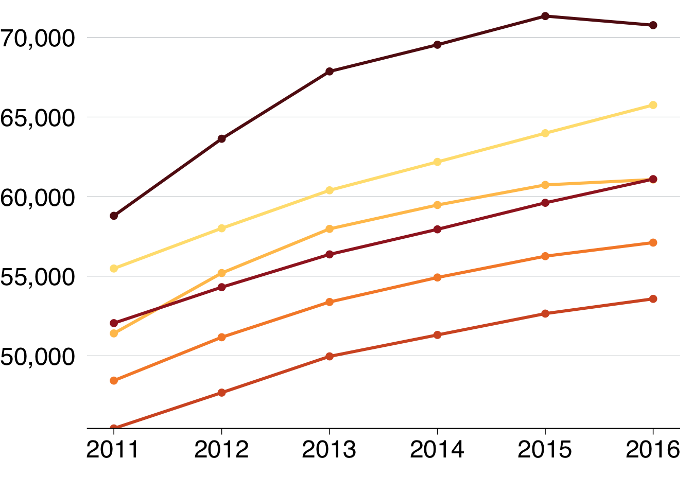

# Chart cookbook

This section takes you through a few often-used chart types. 


## Set up


```r
library(tidyverse)
library(grattantheme)
library(ggrepel)
library(absmapsdata)
library(sf)
library(scales)
library(ggfittext)
```


```r
# note: to be added to grattantheme; remove this when done
grattan_label_repel <- function(..., size = 18) {

  .size = size / ggplot2::.pt
  
  geom_label_repel(..., 
                   fill = "white",
                   label.padding = unit(0.1, "lines"), 
                   label.size = 0,
                   size = .size)
}


grattan_label <- function(..., size = 18) {

  .size = size / ggplot2::.pt
  
  geom_label(..., 
                   fill = "white",
                   label.padding = unit(0.1, "lines"), 
                   label.size = 0,
                   size = .size)
}
```


The `sa3_income` dataset will be used for all key examples in this chapter.^[From [ABS Employee income by occupation and sex, 2010-11 to 2015-16](https://www.abs.gov.au/AUSSTATS/abs@.nsf/DetailsPage/6524.0.55.0022011-2016?OpenDocument)] It is a long dataset from the ABS that contains the median income and number of workers by Statistical Area 3, occupation and sex between 2010 and 2015.


```r
sa3_income <- read_csv("data/sa3_income.csv") %>% 
  filter(!is.na(median_income),
         !is.na(average_income))
```

```
## Parsed with column specification:
## cols(
##   sa3 = col_double(),
##   sa3_name = col_character(),
##   sa3_sqkm = col_double(),
##   sa3_income_percentile = col_double(),
##   sa4_name = col_character(),
##   gcc_name = col_character(),
##   state = col_character(),
##   occupation = col_character(),
##   occ_short = col_character(),
##   prof = col_character(),
##   gender = col_character(),
##   year = col_double(),
##   median_income = col_double(),
##   average_income = col_double(),
##   total_income = col_double(),
##   workers = col_double()
## )
```

```r
head(sa3_income)
```

```
## # A tibble: 6 x 16
##     sa3 sa3_name sa3_sqkm sa3_income_perc… sa4_name gcc_name state
##   <dbl> <chr>       <dbl>            <dbl> <chr>    <chr>    <chr>
## 1 10102 Queanbe…    6511.               80 Capital… Rest of… NSW  
## 2 10102 Queanbe…    6511.               76 Capital… Rest of… NSW  
## 3 10102 Queanbe…    6511.               78 Capital… Rest of… NSW  
## 4 10102 Queanbe…    6511.               76 Capital… Rest of… NSW  
## 5 10102 Queanbe…    6511.               74 Capital… Rest of… NSW  
## 6 10102 Queanbe…    6511.               79 Capital… Rest of… NSW  
## # … with 9 more variables: occupation <chr>, occ_short <chr>, prof <chr>,
## #   gender <chr>, year <dbl>, median_income <dbl>, average_income <dbl>,
## #   total_income <dbl>, workers <dbl>
```


## Bar charts

Bar charts are made with `geom_bar` or `geom_col`. Creating a bar chart will look something like this:


```r
ggplot(data = <data>) + 
  geom_bar(aes(x = <xvar>, y = <yvar>),
     stat = <STAT>, 
     position = <POSITION>
  )
```


It has two key arguments: `stat` and `position`. 

First, `stat` defines what kind of _operation_ the function will do on the dataset before plotting. Some options are:

- `"count"`, the **default**: count the number of observations in a particular group, and plot that number. This is useful when you're using microdata. When this is the case, there is no need for a `y` aesthetic.
- `"sum"`: sum the values of the `y` aesthetic.
- `"identity"`: directly report the values of the `y` aesthetic. This is how PowerPoint and Excel charts work.

You can use **`geom_col`** instead, as a shortcut for `geom_bar(stat = "identity)`. 

Second, `position`, dictates how multiple bars occupying the same x-axis position will positioned. The options are:

- `"stack"`, the default: bars in the same group are stacked atop one another.
- `"dodge"`: bars in the same group are positioned next to one another.
- `"fill"`: bars in the same group are stacked and all fill to 100 per cent.

### Simple bar plot

This section will create the following vertical bar plot showing number of workers by state in 2015:


First, create the data you want to plot. 


```r
data <- sa3_income %>% 
  filter(year == 2015) %>% 
  group_by(state) %>% 
  summarise(workers = sum(workers))

data
```

```
## # A tibble: 8 x 2
##   state workers
##   <chr>   <dbl>
## 1 ACT    386989
## 2 NSW   6527661
## 3 NT     206061
## 4 Qld   4104503
## 5 SA    1382446
## 6 Tas    420767
## 7 Vic   5190976
## 8 WA    2297081
```

Looks fine: you have one observation (row) for each state you want to plot, and a value for their number of workers.

Now pass the nice, simple table to `ggplot` and add aesthetics so that `x` represents `state`, and `y` represents `workers`. Then, because the dataset contains the _actual_ numbers you want on the chart, you can plot the data with `geom_col`:^[Remember that `geom_col` is just shorthand for `geom_bar(stat = "identity")`]


```r
data %>% 
  ggplot(aes(x = state,
             y = workers)) + 
  geom_col()
```


Make it Grattany by adjusting general theme defaults with `theme_grattan`, and use `grattan_y_continuous` to change the y-axis. Use labels formatted with commas (rather than scientific notation) by adding `labels = comma`. 


```r
data %>% 
  ggplot(aes(x = state,
             y = workers)) + 
  geom_col() + 
  theme_grattan() + 
  grattan_y_continuous(labels = comma)
```


To order the states by number of workers, you can tell the `x` aesthetic that you want to `reorder` the `state` variable by `workers`:


```r
data %>% 
  ggplot(aes(x = reorder(state, workers), # reorder states by workers
             y = workers)) + 
  geom_col() + 
  theme_grattan() + 
  grattan_y_continuous(labels = comma)
```


You can probably drop the x-axis label -- people will understand that they're states without you explicitly saying it -- and add a title and subtitle with `labs`:


```r
simple_bar <- data %>% 
  ggplot(aes(x = reorder(state, workers),
             y = workers)) + 
  geom_col() + 
  theme_grattan() + 
  grattan_y_continuous(labels = comma) + 
  labs(title = "Most workers are on the east coast",
       subtitle = "Number people in employment, 2015",
       x = "",
       caption = "Notes: Only includes people who submitted a tax return in 2015-16. Source: ABS (2018)")

simple_bar
```


Looks supreme! Now you can export as a full-slide Grattan chart using `grattan_save`:


```r
grattan_save("atlas/simple_bar.pdf", simple_bar, type = "fullslide")
```


### Bar plot with multiple series {#bar-multi}

This section will create a horizontal bar plot showing average income by state and gender in 2015:


First create the dataset you want to plot, getting the average income by state and gender in the year 2015:


```r
data <- sa3_income %>% 
  filter(year == 2015) %>%   
  group_by(state, gender) %>%   
  summarise(average_income = sum(total_income) / sum(workers))

data
```

```
## # A tibble: 16 x 3
## # Groups:   state [8]
##    state gender average_income
##    <chr> <chr>           <dbl>
##  1 ACT   Men            78141.
##  2 ACT   Women          65548.
##  3 NSW   Men            69750.
##  4 NSW   Women          53191.
##  5 NT    Men            75246.
##  6 NT    Women          58527.
##  7 Qld   Men            65108.
##  8 Qld   Women          48458.
##  9 SA    Men            60244.
## 10 SA    Women          47533.
## 11 Tas   Men            56345.
## 12 Tas   Women          45158.
## 13 Vic   Men            64908.
## 14 Vic   Women          49264.
## 15 WA    Men            76677.
## 16 WA    Women          51578.
```

Looks admirable: you have one observation (row) for each state $\times$ gender group you want to plot, and a value for their average income. Put `state` on the x-axis, `average_income` on the y-axis, and split gender by fill-colour (`fill`).


Pass the data to `ggplot`, give it the appropriate `x` and `y` aesthetics, along with `fill` (the fill colour^[The aesthetic `fill` represents the 'fill' colour -- the colour that fills the bars in your chart. The `colour` aesthetic controls the colours of the _lines_.]) representing `gender`. And because you have the _actual_ values for `average_income` you want to plot, use `geom_col`:^[`geom_col` is shorthand for `geom_bar(stat = "identity"`] 


```r
data %>% 
  ggplot(aes(x = state,
             y = average_income,
             fill = gender)) + 
  geom_col()
```


The two series -- women and men -- created by `fill` are stacked on-top of each other by `geom_col`. You can tell it to plot them next to each other -- to 'dodge' -- instead with the `position` argument _within_ `geom_col`:


```r
data %>% 
  ggplot(aes(x = state,
             y = average_income,
             fill = gender)) + 
  geom_col(position = "dodge") # 'dodge' the series
```


To flip the chart -- a useful move when you have long labels -- add `coord_flip` (ie 'flip the x and y coordinates of the chart'). 

However, while the _coordinates_ have been flipped, the underlying data hasn't. If you want to refer to the `average_income` axis, which now lies horizontally, you would still refer to the `y` axis (eg `grattan_y_continuous` still refers to your `y` aesthetic, `average_income`). 


```r
data %>% 
  ggplot(aes(x = state,
             y = average_income,
             fill = gender)) + 
  geom_col(position = "dodge") + 
  coord_flip() # rotate the chart
```


And reorder the states by average income, so that the state with the highest (combined) average income is at the top. This is done with the `reorder(var_to_reorder, var_to_reorder_by)` function when you define the `state` aesthetic:


```r
data %>% 
  ggplot(aes(x = reorder(state, average_income), # reorder
             y = average_income,
             fill = gender)) + 
  geom_col(position = "dodge") + 
  coord_flip()
```


Wonderful -- that's how you want our _data_ to look. Now you can Grattanise it. Note that `theme_grattan` needs to know that the coordinates were flipped so it can apply the right settings. Also tell `grattan_fill_manual` that there are two fill series. 


```r
data %>% 
  ggplot(aes(x = reorder(state, average_income), # reorder
             y = average_income,
             fill = gender)) + 
  geom_col(position = "dodge") + 
  coord_flip() + 
  theme_grattan(flipped = TRUE) + 
  grattan_y_continuous(labels = dollar) + 
  grattan_fill_manual(2)
```


You can use `grattan_label` to **label your charts** in the Grattan style. This function is a 'wrapper' around `geom_label` that has settings that we tend to like: white background with a thin margin, 18-point font, and no border. It takes the [standard arguments of `geom_label`](https://ggplot2.tidyverse.org/reference/geom_text.html). 

Section \@ref(adding-labels) shows how labels are treated like data points: they need to know where to go (`x` and `y`) and what to show (`label`). But if you provide _every point_ to your labelling `geom`, it will plot every label:


```r
data %>% 
  ggplot(aes(x = reorder(state, average_income), # reorder
             y = average_income,
             fill = gender)) + 
  geom_col(position = "dodge") + 
  coord_flip() + 
  theme_grattan(flipped = TRUE) + 
  grattan_y_continuous(labels = dollar) + 
  grattan_fill_manual(2) + 
  grattan_label(aes(colour = gender,  # colour the text according to gender
                    label = gender),  # label the text according to gender
            position = position_dodge(width = 1),  # position dodge with width 1
            hjust = -0.1) +  # horizontally align the label so its outside the bar
  grattan_colour_manual(2)   # define colour as two grattan colours
```


To just label _one_ of the plots -- ie the first one, ACT in this case -- we need to tell `grattan_label`. The easiest way to do this is by **creating a label dataset beforehand**, like `label_gender` below. This just includes the observations you want to label:


```r
label_gender <- data %>% 
  filter(state == "ACT")  # just want Tasmania observations

label_gender
```

```
## # A tibble: 2 x 3
## # Groups:   state [1]
##   state gender average_income
##   <chr> <chr>           <dbl>
## 1 ACT   Men            78141.
## 2 ACT   Women          65548.
```

So you can pass that `label_gender` dataset to `grattan_label`:


```r
data %>% 
  ggplot(aes(x = reorder(state, average_income), # reorder
             y = average_income,
             fill = gender)) + 
  geom_col(position = "dodge") + 
  coord_flip() + 
  theme_grattan(flipped = TRUE) + 
  grattan_y_continuous(labels = dollar) + 
  grattan_fill_manual(2) + 
  grattan_label(data = label_gender,  # supply the new dataset
                aes(colour = gender,
                    label = gender), 
                position = position_dodge(width = 1), 
                hjust = -0.1) + 
  grattan_colour_manual(2)
```


Almost there! The labels go out of range a little bit, and we can fix this by expanding the plot:


```r
data %>% 
  ggplot(aes(x = reorder(state, average_income), # reorder
             y = average_income,
             fill = gender)) + 
  geom_col(position = "dodge") + 
  coord_flip() + 
  theme_grattan(flipped = TRUE) + 
  grattan_y_continuous(labels = dollar, 
                       expand_top = .1) + 
  grattan_fill_manual(2) + 
  grattan_label(data = label_gender,  # supply the new dataset
                aes(colour = gender,
                    label = gender), 
                position = position_dodge(width = 1), 
                hjust = -0.1) + 
  grattan_colour_manual(2)
```


Looks of high quality! Now you can add labels and save using `grattan_save`:


```r
multiple_bar <- data %>% 
  ggplot(aes(x = reorder(state, average_income), # reorder
             y = average_income,
             fill = gender)) + 
  geom_col(position = "dodge") + 
  coord_flip() + 
  theme_grattan(flipped = TRUE) + 
  grattan_y_continuous(labels = dollar, 
                       expand_top = .1) + 
  grattan_fill_manual(2) + 
  grattan_label(data = label_gender,  # supply the new dataset
                aes(colour = gender,
                    label = gender), 
                position = position_dodge(width = 1), 
                hjust = -0.1) + 
  grattan_colour_manual(2) + 
  labs(title = "Women earn less in every state",
       subtitle = "Average income of workers, 2015",
       x = "",
       y = "",
       caption = "Notes: Only includes people who submitted a tax return in 2015-16. Source: ABS (2018)")
```


```r
grattan_save("atlas/multiple_bar.pdf", multiple_bar, type = "fullslide")
```


### Facetted bar charts {#facet-bar}

'Facetting' a chart means you create a separate plot for each group. It's particularly useful in showing differences between groups. The chart you'll make in this section will show annual income by gender and state, and by professional and non-professional workers:


Start by creating the dataset you want to plot:


```r
data <- sa3_income %>% 
  group_by(state, gender, prof) %>% 
  summarise(average_income = sum(total_income) / sum(workers))

data
```

```
## # A tibble: 32 x 4
## # Groups:   state, gender [16]
##    state gender prof             average_income
##    <chr> <chr>  <chr>                     <dbl>
##  1 ACT   Men    Non-professional         52545.
##  2 ACT   Men    Professional             96488.
##  3 ACT   Women  Non-professional         46151.
##  4 ACT   Women  Professional             79828.
##  5 NSW   Men    Non-professional         49182.
##  6 NSW   Men    Professional             91624.
##  7 NSW   Women  Non-professional         36772.
##  8 NSW   Women  Professional             68445.
##  9 NT    Men    Non-professional         58844.
## 10 NT    Men    Professional             87666.
## # … with 22 more rows
```

Then plot a bar chart with `geom_col` and `theme_grattan` elements, using a similar chain to the final plot of \@ref(bar-multi) (without the labelling). We'll build on this chart:


```r
facet_bar <- data %>% 
  ggplot(aes(x = reorder(state, average_income),
             y = average_income,
             fill = gender)) + 
  geom_col(position = "dodge") + 
  coord_flip() + 
  theme_grattan(flipped = TRUE) + 
  grattan_y_continuous(labels = dollar, 
                       expand_top = .1) + 
  grattan_fill_manual(2) + 
  grattan_colour_manual(2) + 
  labs(title = "Women earn less in every state",
       subtitle = "Average income of workers, 2015",
       x = "",
       y = "",
       caption = "Notes: Only includes people who submitted a tax return in 2015-16. Source: ABS (2018)")
```


You can 'facet' bar charts -- and any other chart type -- with the `facet_grid` or `facet_wrap` commands. The latter tends to give you more control over label placement, so let's start with that. `fadcet_wrap` asks the questions: "what variables should I create separete charts for", and "how should I place them on the page"? Tell it to use the `prof` variable with the `vars()` function.^[The `vars()` function is sometimes used in the `tidyverse` to specifically say "I am using a variable name here". You can't use variable names directly because of legacy issues. You can learn more about it in the [official documentation](https://ggplot2.tidyverse.org/reference/facet_wrap.html).]


```r
facet_bar +
  facet_wrap(vars(prof))
```


That's good! It does what it should. You just need to tidy it up a little bit

First, create a summary dataset of average income by professional employment, state and gender:


```r
data <- sa3_income %>% 
  group_by(prof, state, gender) %>% 
  summarise(average_income = sum(total_income) / sum(workers))

head(data)
```

```
## # A tibble: 6 x 4
## # Groups:   prof, state [3]
##   prof             state gender average_income
##   <chr>            <chr> <chr>           <dbl>
## 1 Non-professional ACT   Men            52545.
## 2 Non-professional ACT   Women          46151.
## 3 Non-professional NSW   Men            49182.
## 4 Non-professional NSW   Women          36772.
## 5 Non-professional NT    Men            58844.
## 6 Non-professional NT    Women          43025.
```

Then plot a bar chart, similar to the one you made before, but add `facet_wrap` to the chain:


```r
data %>% 
  ggplot(aes(x = reorder(state, average_income),         
             y = average_income,
             fill = gender)) +  
  geom_col(position = position_dodge()) + 
  theme_grattan(flipped = TRUE) +
  grattan_y_continuous(labels = dollar) +
  grattan_fill_manual(2) + 
  labs(x = "",
       y = "") + 
  coord_flip() + 
  facet_wrap(prof ~ .) # facet 'prof' around nothing else '.'
```


Cool! Now you just have to tweak some settings to get the plot looking right on the page:

- Add a black line along `average_income = 0` to distinguish the plots. 
- Define your 'breaks' (the spacing of the axis gridlines and labels) in `grattan_y_continuous`. 
- Add some additional space -- `10mm` -- between the two facet plots with `panel.spacing = unit(10, "mm")` in the `theme` parameter.^[The `unit` function takes two arguments: the number of the unit, then the unit itself (eg "mm" for millimetre, or "cm" for centremetre, etc.)] 
- Left-align the facet titles with `strip.text = element_text(hjust = 0)`.^[The function `element_text` is useful for adjusting the look of text in a plot. With it, you can say you want the text to be red, `colour = "red"`, or MASSIVE, `size = 100`, or **bold**, `face = "bold"`.] 
- We're a bit tight for space along the bottom, so get rid of the "$" and replace with "comma", then add that information in the `y` label.


```r
facet_bar <- data %>% 
  ggplot(aes(x = reorder(state, average_income),         
             y = average_income,
             fill = gender)) +  
  geom_col(position = position_dodge()) + 
  geom_hline(yintercept = 0) + # add a black base line for each facet
  theme_grattan(flipped = TRUE) +
  grattan_y_continuous(labels = comma, # change to comma
                       breaks = c(0, 25e3, 50e3, 75e3)) + # define your breaks
  grattan_fill_manual(2) + 
  labs(x = "",
       y = "Annual income, $") + # add $ info in y-label
  coord_flip() + 
  theme(panel.spacing = unit(10, "mm"), # add some space between the plots
        strip.text = element_text(hjust = 0)) + # left-align facet titles
  facet_wrap(prof ~ .)

facet_bar
```


**Finally**, we'll add the women/men labels by creating a dataset with the labels we want and giving that to `grattan_label`. 


```r
label_data <- data %>% 
  filter(state == "ACT",
         prof == "Non-professional")


facet_bar +
  grattan_label(data = label_data,  # supply the new dataset
                aes(colour = gender,
                    label = gender), 
                position = position_dodge(width = 1), 
                hjust = -.1) + 
  grattan_colour_manual(2) # define the colour scale
```


## Line charts

A line chart has one key aesthetic: `group`. This tells `ggplot` how to connect individual lines. 

First, we'll take the `sa3_income` dataset and create a summary table of total workers and income by year, state, professional work and gender. We'll use this `sa3_income` throughout this section, and we'll ignore ACT and NT.


```r
data <- sa3_income %>% 
  filter(!state %in% c("ACT", "NT")) %>% 
  group_by(year, state) %>% 
  summarise(workers = sum(workers),
            average_income = sum(total_income) / workers)

data
```

```
## # A tibble: 36 x 4
## # Groups:   year [6]
##     year state workers average_income
##    <dbl> <chr>   <dbl>          <dbl>
##  1  2010 NSW   5854166         55483.
##  2  2010 Qld   3777991         51408.
##  3  2010 SA    1323120         48443.
##  4  2010 Tas    412691         45439.
##  5  2010 Vic   4613674         52053.
##  6  2010 WA    2016695         58795.
##  7  2011 NSW   5956919         58011.
##  8  2011 Qld   3891702         55200.
##  9  2011 SA    1339193         51166.
## 10  2011 Tas    410521         47688.
## # … with 26 more rows
```

Plot a line chart by taking the `data`, passing it to `ggplot` with  *aes*thetics, then using `geom_line`:


```r
data %>% 
  ggplot(aes(x = year,
             y = average_income,
             group = state)) + 
  geom_line()
```


Now you can represent each `state` by colour:


```r
data %>% 
  ggplot(aes(x = year,
             y = average_income,
             group = state,
             colour = state)) + 
  geom_line()
```


Cooler! Adding some Grattan formatting to it and define it as our 'base chart':


```r
base_chart <-data %>% 
  ggplot(aes(x = year,
             y = average_income,
             group = state,
             colour = state)) + 
  geom_line() +
  theme_grattan() + 
  grattan_y_continuous(labels = comma) + 
  grattan_colour_manual(6) +
  labs(x = "",
       y = "")

base_chart
```


You can add 'dots' for each year by layering `geom_point` on top of `geom_line`:


```r
base_chart +
  geom_point()
```



To add labels to the end of each line, you would expand the x-axis to make room for labels and add reasonable breaks:


```r
base_chart +
  grattan_x_continuous(expand_right = .3,
                       breaks = seq(2010, 2015, 1),
                       labels = c("2010", "11", "12", "13", "14", "15")) 
```


Then add labels, using 


```r
label_line <- data %>% 
  filter(year == 2010)

base_chart +
  geom_point() +
  grattan_x_continuous(expand_left = .1,
                       breaks = seq(2010, 2015, 1),
                       labels = c("2010", "11", "12", "13", "14", "15")) +
  grattan_label(data = label_line,
                aes(label = state),
                nudge_x = -Inf,
                segment.colour = NA)
```

```
## Warning: Ignoring unknown parameters: segment.colour
```


If you wanted to show each state individually, you could **facet** your chart so that a separate plot was produced for each state:


```r
base_chart +
  geom_point() +
    grattan_x_continuous(expand_left = .1, 
                         expand_right = .1,
                         breaks = seq(2010, 2015, 1),
                         labels = c("2010", "11", "12", "13", "14", "15")) +
  theme(panel.spacing.x = unit(10, "mm")) + 
  facet_wrap(state ~ .)
```


## Scatter plots

Scatter plots require `x` and `y` aesthetics. These can then be coloured and faceted.


For the first plot, we'll use the `sa3_income` dataset in 2015, looking at the incomes of non-professional workers by their area's total income percentile:


```r
income <- sa3_income %>% 
  filter(year == 2015) %>%
  mutate(total_income = average_income * workers) %>% 
  group_by(sa3_name, sa3_income_percentile, prof, occ_short) %>% 
  summarise(income = sum(total_income),
            workers = sum(workers),
            average_income = income / workers)

head(income)
```

```
## # A tibble: 6 x 7
## # Groups:   sa3_name, sa3_income_percentile, prof [1]
##   sa3_name  sa3_income_perce… prof  occ_short income workers average_income
##   <chr>                 <dbl> <chr> <chr>      <dbl>   <dbl>          <dbl>
## 1 Adelaide…                66 Non-… Admin     1.44e8    2674         53979.
## 2 Adelaide…                66 Non-… Driver    1.85e7     396         46762.
## 3 Adelaide…                66 Non-… Labourer  3.92e7    1516         25868.
## 4 Adelaide…                66 Non-… Sales     5.05e7    1546         32680.
## 5 Adelaide…                66 Non-… Service   7.75e7    2346         33034.
## 6 Adelaide…                66 Non-… Trades    7.85e7    1525         51448.
```

To make a scatter plot with `average_income` against `sa3_income_percentile`, pass the `income` dataset to `ggplot`, add `x = sa3_income_percentile`, `y = average_income` and `colour = gender` aesthetics, then plot it with `geom_point`:


```r
income %>% 
  ggplot(aes(x = sa3_income_percentile,
             y = average_income,
             colour = prof)) +
  geom_point()
```


Nice. There are lots of overlapping points, so decreasing the opacity with `alpha = 0.6` will make the plot a little clearer. Make this your `base_chart`: 


```r
base_chart <- income %>% 
  ggplot(aes(x = sa3_income_percentile,
             y = average_income,
             colour = prof)) +
  geom_point(alpha = 0.2)


base_chart
```


Now add your theme objects: 

- `theme_grattan()`, telling it that the `chart_type` is a scatter plot.
- `grattan_colour_manual()` with `2` colours.
- `grattan_y_continuous()`, setting the label style to `dollar`. Also tell the plot to start at zero by setting `limits = c(0, NA)` (lower, upper limits, with `NA` representing 'choose automatically'). Note that starting at zero isn't a requirement for scatter plots, but here it will give you some breathing space for your labels.
- `grattan_x_continuous()`. 
- Axes labels with `labs`. 


```r
base_theme <- base_chart + 
  theme_grattan(chart_type = "scatter") + 
  grattan_colour_manual(2) + 
  grattan_y_continuous(labels = dollar, 
                       limits = c(0, NA)) + 
  grattan_x_continuous() + 
  labs(x = "Area income percentile",
       y = "Average income")
  
base_theme
```


Looks on fleek! To make the point a little clearer, we can overlay a point for average income each percentile. Create a dataset that has the average income for each area and professional work category:


```r
perc_average <- income %>% 
  group_by(prof, sa3_income_percentile) %>% 
  summarise(average_income = sum(income) / sum(workers))

head(perc_average)
```

```
## # A tibble: 6 x 3
## # Groups:   prof [1]
##   prof             sa3_income_percentile average_income
##   <chr>                            <dbl>          <dbl>
## 1 Non-professional                     1         40515.
## 2 Non-professional                     2         42689.
## 3 Non-professional                     3         42280.
## 4 Non-professional                     4         42600.
## 5 Non-professional                     5         43868.
## 6 Non-professional                     6         42615.
```

Then layer this on your plot by adding another `geom_point` and providing the `perc_average` data. Add a `fill` aesthetic and change the shape to `21`: a circle with a border (controlled by `colour`) and fill colour (controlled by `fill`).^[See the full list of shapes [here](https://ggplot2.tidyverse.org/reference/scale_shape.html).]
Make the outline of the circle black with `colour` and make the `size` a little bigger:


```r
scatter_plot <- base_theme +
  geom_point(data = perc_average,
             aes(fill = prof),
             shape = 21,
             size = 3, 
             colour = "black") + 
  grattan_fill_manual(2)

scatter_plot
```


### Adding labels

To add labels, first decide where they'd fit best. First, try positioning the <font color='#A02226'>Professional</font> above its averages, and <font color='#F68B33'>Non-professional</font> at the bottom. 

Like labelling before, you should create a new dataset with your label information, and pass that label dataset to the `grattan_label` function:


```r
label_data <- tibble(
  sa3_income_percentile = c(50, 50),
  average_income = c(15e3, 120e3),
  prof =  c("Non-professional", "Professional"))
```


```r
scatter_plot + 
  grattan_label(data = label_data,
                aes(label = prof))
```


Like the charts above, you could **facet** this by state to see if there were any interesting patterns. The territories only have 


To make a scatter plot with `average_income` against `workers`, pass the `income` dataset
to `ggplot`, add `x = workers`, `y = average_income` and `colour = gender` aesthetics, then plot it with `geom_point`:
 

```r
income %>% 
  ggplot(aes(x = sa3_income_percentile,
             y = workers,
             colour = prof)) + 
  geom_point()
```


Nice. There are lots of overlapping points, so decreasing the opacity with `alpha = 0.6` will make the plot a little clearer. Make this your `base_chart`: 
Add Grattan-y elements: `theme_grattan` with `chart_type = "scatter"`; `grattan_y_continuous` with `labels = dollar`; and `grattan_colour_manual` with `2` colours. Also change the x-axis to a log scale with `scale_x_log10` and set the labels to `comma`. Finally, add your axis labels: 


```r
base_chart <- income %>% 
  ggplot(aes(x = sa3_income_percentile,
             y = workers,
             colour = prof)) + 
  geom_point(alpha = .3) +
  theme_grattan(chart_type = "scatter") + 
  grattan_y_continuous(labels = comma) +
  grattan_x_continuous() + 
  grattan_colour_manual(2) + 
  labs(x = "Area income percentile",
       y = "Workers")

base_chart
```


It looks like the areas with the largest population grew the most between 2013 and 2018. To explore the relationship further, you can add a line-of-best-fit with `geom_smooth`:


```r
base_chart + 
  geom_smooth(aes(fill = prof)) + 
  grattan_fill_manual(2)
```


```r
base_chart + 
  geom_smooth(aes(fill = prof)) + 
  grattan_fill_manual(2)
```


## Distributions

`geom_histogram`
`geom_density`

`ggridges::`


## Maps

### `sf` objects
[what is]

### Using `absmapsdata`

The `absmapsdata` contains compressed, and tidied `sf` objects containing geometric information about ABS data structures. The included objects are:

  - Statistical Area 1 2011 and 2016: `sa12011` or `sa12016`
  - Statistical Area 2 2011 and 2016: `sa22011` or `sa22016`
  - Statistical Area 3 2011 and 2016: `sa32011` or `sa32016`
  - Statistical Area 4 2011 and 2016: `sa42011` or `sa42016`
  - Greater Capital Cities 2011 and 2016: `gcc2011` or `gcc2016`
  - Remoteness Areas 2011 and 2016: `ra2011` or `ra2016`
  - State 2011 and 2016: `state2011` or `state2016`
  - Commonwealth Electoral Divisions 2018: `ced2018`
  - State Electoral Divisions 2018:`sed2018`
  - Local Government Areas 2016 and 2018: `lga2016` or `lga2018`
  - Postcodes 2016: `postcodes2016`

The package is [hosted on Github](https://github.com/wfmackey/absmapsdata) and can be installed with `remotes::install_github()`


```r
remotes::install_github("wfmackey/absmapsdata")
library(absmapsdata)
```

You will also need the `sf` package installed to handle the `sf` objects:


```r
install.packages("sf")
library(sf)
```

Now you can view `sf` objects stored in `absmapsdata`:


```r
glimpse(sa32016)
```

```
## Observations: 358
## Variables: 12
## $ sa3_code_2016   <chr> "10102", "10103", "10104", "10105", "10106", "10…
## $ sa3_name_2016   <chr> "Queanbeyan", "Snowy Mountains", "South Coast", …
## $ sa4_code_2016   <chr> "101", "101", "101", "101", "101", "102", "102",…
## $ sa4_name_2016   <chr> "Capital Region", "Capital Region", "Capital Reg…
## $ gcc_code_2016   <chr> "1RNSW", "1RNSW", "1RNSW", "1RNSW", "1RNSW", "1G…
## $ gcc_name_2016   <chr> "Rest of NSW", "Rest of NSW", "Rest of NSW", "Re…
## $ state_code_2016 <chr> "1", "1", "1", "1", "1", "1", "1", "1", "1", "1"…
## $ state_name_2016 <chr> "New South Wales", "New South Wales", "New South…
## $ areasqkm_2016   <dbl> 6511.1906, 14283.4221, 9864.8680, 9099.9086, 121…
## $ cent_long       <dbl> 149.6013, 148.9415, 149.8063, 149.6054, 148.6799…
## $ cent_lat        <dbl> -35.44939, -36.43952, -36.49933, -34.51814, -34.…
## $ geometry        <MULTIPOLYGON [°]> MULTIPOLYGON (((149.979 -35..., MUL…
```


### Making choropleth maps

Choropleth maps break an area into 'bits', and colours each 'bit' according to a variable.

You can join the `sf` objects from `absmapsdata` to your dataset using `left_join`. The variable names might be different -- eg `sa3_name` compared to `sa3_name_2016` -- so use the `by` argument to match them.

First, take the `sa3_income` dataset and join the `sf` object `sa32016` from `absmapsdata`:


```r
map_data <- sa3_income %>% 
  left_join(sa32016, by = c("sa3_name" = "sa3_name_2016"))
```

You then plot a map like you would any other `ggplot`: provide your data, then choose your `aes` and your `geom`. For maps with `sf` objects, the **key aesthetic** is `geometry = geometry`, and the **key geom** is `geom_sf`.

The argument `lwd` controls the line width of area borders.

Note that RStudio takes a long time to render a map in the 


Showing all of Australia on a single map is difficult: there are enormous areas that are home to few people which dominate the space. Showing individual states or capital city areas can sometimes be useful. 

To do this, filter the `map_data` object: 


#### Adding labels to maps

You can add labels to choropleth maps with the standard `geom_text` or `geom_label`. Because it is likely that some labels will overlap, `ggrepel::geom_text_repel` or `ggrepel::geom_label_repel` is usually the better option.

To use `geom_(text|label)_repel`, you need to tell `ggrepel` where in 


```r
map <- map_data %>% 
        filter(state == "Vic") %>% 
        ggplot(aes(geometry = geometry)) +
        geom_sf(aes(fill = pop_change),
                lwd = .1,
                colour = "black") +
        theme_void() +
        grattan_fill_manual(discrete = FALSE, 
                            palette = "diverging",
                            limits = c(-20, 20),
                            breaks = seq(-20, 20, 10)) +
  geom_label_repel(aes(label = sa3_name),
                  stat = "sf_coordinates", nudge_x = 1000, segment.alpha = .5,
                  size = 4, 
                  direction = "y",
                  label.size = 0, 
                  label.padding = unit(0.1, "lines"),
                  colour = "grey50",
                  segment.color = "grey50") + 
  scale_y_continuous(expand = expand_scale(mult = c(0, .2))) + 
  theme(legend.position = "top") + 
  labs(fill = "Population \nchange")

map
```


## Creating simple interactive graphs with `plotly`

`plotly::ggplotly()`


